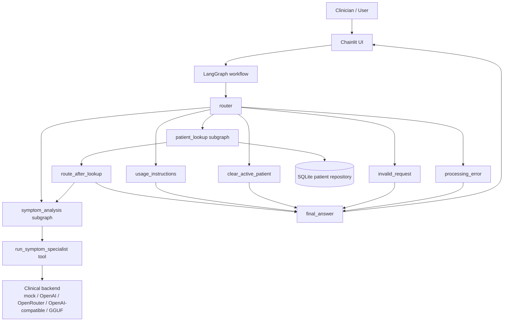
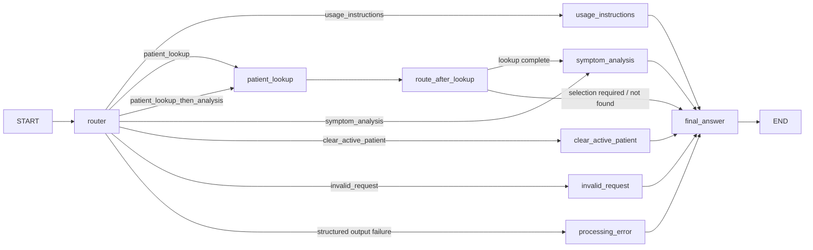

# Screening Robot

[](https://www.python.org/)
[](https://docs.langchain.com/oss/python/langgraph/overview)
[](https://docs.chainlit.io/)
[](https://unsloth.ai/docs)
[](https://huggingface.co/luizaaca)

🇧🇷 [Read in Portuguese](README_pt-br.md)

Clinical screening assistant that connects **fine-tuned Qwen models**, a **LangGraph orchestration layer**, a **Chainlit conversational UI**, and **SQLite-backed patient retrieval** into a single end-to-end project.

This repository was designed to satisfy the **Tech Challenge – Fase 3** academic requirements while also serving as a professional portfolio project. It covers the full lifecycle: dataset engineering, QLoRA fine-tuning, structured clinical inference, retrieval-augmented patient context, observability, and a modular Python runtime.

## Table of Contents

- [Overview](#overview)
- [How this repository satisfies the academic brief](#how-this-repository-satisfies-the-academic-brief)
- [Architecture at a glance](#architecture-at-a-glance)
- [Fine-tuning pipeline and model evolution](#fine-tuning-pipeline-and-model-evolution)
- [Published model registry](#published-model-registry)
- [LangGraph assistant runtime](#langgraph-assistant-runtime)
- [Security, validation, and explainability](#security-validation-and-explainability)
- [Repository structure](#repository-structure)
- [Technology stack](#technology-stack)
- [Getting started](#getting-started)
- [Example prompts](#example-prompts)
- [Notebooks, scripts, and datasets](#notebooks-scripts-and-datasets)
- [Testing](#testing)
- [Official references](#official-references)
- [Limitations](#limitations)

## Overview

`Screening Robot` is an agentic clinical screening prototype built around two complementary layers:

1. **Control layer** — routes user requests, manages tools, handles patient lookup, and composes the final answer.
2. **Clinical specialist layer** — produces structured clinical screening output that can be consumed reliably by the graph.

The project evolved from notebook-only experiments into a modular Python application under `src/screening_agent/`, with:

- **LangGraph** for stateful orchestration and conditional routing;
- **LangChain** abstractions for models, tools, and message handling;
- **Chainlit** for the interactive web chat experience;
- **Pydantic** schemas for structured outputs and validation;
- **SQLite** for retrieval-augmented patient context;
- **Unsloth + QLoRA** for efficient fine-tuning of Qwen models;
- **GGUF compatibility** for local clinical inference.

The academic version of the project uses **public clinical symptom datasets, curated synthetic enrichment, and synthetic patient records** instead of real hospital PHI. That keeps the deliverable reproducible and safe to share while still demonstrating the architectural requirements requested in the brief.

## How this repository satisfies the academic brief

The PDF requirement list in `8IADT - Fase 3 - Tech challenge.pdf` asks for fine-tuning, a LangChain-based assistant, security/validation, modular Python code, synthetic or anonymized data, LangGraph flows, and a detailed report. This README is written to function as that technical report.

| Academic requirement | Where it is implemented | Evidence in this repository |
| --- | --- | --- |
| Fine-tuning of an LLM with medical data | Training notebooks + custom dataset pipeline | `screening_robot.ipynb`, `screening_robot_qwen3_1_7b_json.ipynb`, `process_clinical_batches.py` |
| Preprocessing, anonymization, and curation | Dataset normalization + synthetic data strategy | `process_clinical_batches.py`, `dataset_augmentation.ipynb`, `seed_demo_data.py`, synthetic SQLite demo DB |
| Medical assistant with LangChain | Model/tool abstractions and prompt-driven workflow | `src/screening_agent/model/`, `src/screening_agent/tools/`, `src/screening_agent/prompts/` |
| LangGraph workflow orchestration | Stateful graph + subgraphs + conditional edges | `src/screening_agent/graph/` |
| Structured database access / contextualization | SQLite retrieval and patient activation flow | `src/screening_agent/data/patient_repository.py`, `src/screening_agent/tools/patient_tools.py` |
| Security limits and validation | Fail-closed routing, disclaimers, retries, schema validation | `src/screening_agent/model/structured_output.py`, `src/screening_agent/graph/nodes/processing_error.py` |
| Detailed logging and audit trail | Audit events + console debug modes | `src/screening_agent/audit.py`, `.env.example` |
| Explainability / source transparency | Router rationale, structured specialist output, patient context trace | `src/screening_agent/graph/state.py`, `specialist_tool.py`, `finalize_response.py` |
| Modular Python project | Package under `src/` with clear separation of concerns | `src/screening_agent/` |
| Complete README | This document + Portuguese version | `README.md`, `README_pt-br.md` |

## Architecture at a glance



### Runtime highlights

- The graph starts in a **router node** that classifies the user intent with structured output.
- The **patient lookup subgraph** can search by fictional security number or patient name, including name disambiguation.
- The **symptom analysis subgraph** invokes a dedicated specialist tool that returns structured clinical output.
- The **final answer node** transforms internal structured data into the user-facing response streamed in Chainlit.
- The Chainlit UI intentionally streams only the tokens produced by the `final_answer` node, keeping intermediate tool chatter out of the user experience.

### Assistant state

The runtime extends LangGraph's `MessagesState` with assistant-specific fields such as:

- `active_patient`
- `patient_lookup_status`
- `patient_lookup_candidates`
- `router_intent`
- `router_rationale`
- `specialist_output_json`
- `last_response`

This state design allows the assistant to preserve short-term context across turns without hard-coding business logic into the UI layer.

## Fine-tuning pipeline and model evolution

The project contains **two fine-tuning generations**, and the difference between them matters.

### Version 1 — `screening_robot.ipynb`

The first training notebook fine-tunes **Qwen3-0.6B** with QLoRA using a symptom-to-disease formulation that asks the model to produce a final disease answer wrapped in a fixed clinical disclaimer format.

Key characteristics:

- base model geared toward lightweight experimentation;
- mixed `/think` and `/no_think` style prompting;
- evaluation with **accuracy**, **macro-F1**, **Cohen's Kappa**, **confusion matrices**, and **BERTScore**;
- LoRA + GGUF export path.

Why it was not selected for the final agent:

- the model did not internalize the reasoning behavior as strongly as needed for downstream orchestration;
- the fixed disclaimer-oriented answer shape was not ideal for a specialist tool inside a LangGraph workflow;
- free-form answers were harder to validate and integrate reliably inside a tool-calling agent.

### Version 2 — `screening_robot_qwen3_1_7b_json.ipynb`

The second notebook fine-tunes **Qwen3-1.7B-Base** using **Unsloth + QLoRA** for a much narrower and more production-friendly objective: emitting a validated JSON payload tailored for the specialist tool used by the runtime.

Target schema:

```json
{
  "support_status": "supported | inconclusive",
  "candidate_diseases": ["..."],
  "recommended_exams_tests": ["..."]
}
```

Why this version became the preferred model for the assistant:

- **better alignment with agent design**;
- **structured output is easier to validate, retry, and audit**;
- **1.7B parameters hit a better trade-off** between capability and local efficiency for the intended use case;
- it integrates naturally with the `run_symptom_specialist` tool and the `final_answer` composition step.

### Dataset engineering and curation

The training data did not come straight from a single CSV and call it a day — that would be too easy, and much less useful.

The pipeline combines public datasets and custom enrichment steps:

1. Merge symptom/disease sources into `combined_diseases_symptoms_2.csv`.
2. Run `process_clinical_batches.py` to generate:
   - `support_status`
   - `candidate_diseases`
   - `recommended_exams_tests`
   - `reasoning`
3. Persist the enriched artifact to `combined_diseases_symptoms_2_enriched_with_exams_v2.csv`.
4. Publish the resulting dataset to Kaggle: [`luizaaca/symptoms-to-diseases-with-reasoning`](https://www.kaggle.com/datasets/luizaaca/symptoms-to-diseases-with-reasoning).

The enrichment pipeline includes:

- symptom normalization;
- heuristic support scoring;
- TF-IDF-style symptom weighting;
- web-assisted exam suggestion gathering;
- stable disease candidate ordering;
- curation for structured downstream training.

For the runtime layer, patient data is intentionally **synthetic** and stored in SQLite. Demo records use fictional identifiers and narrative clinical context so the repository can be shared publicly.

### Training configuration used in the 1.7B JSON experiment

| Parameter | Value |
| --- | --- |
| Base model | `Qwen/Qwen3-1.7B-Base` |
| Fine-tuning method | QLoRA with Unsloth |
| Quantization | 4-bit |
| LoRA rank | 16 |
| LoRA alpha | 32 |
| Max sequence length | 1024 |
| Batch size | 2 |
| Gradient accumulation | 4 |
| Warmup steps | 20 |
| Max steps | 400 |
| Learning rate | `2e-4` |
| Weight decay | `0.01` |
| Loss masking | response-only supervision |

### Evaluation methodology

The notebooks evaluate both modeling quality and operational reliability.

**Clinical prediction metrics**

- Accuracy
- F1-macro
- Cohen's Kappa
- Confusion matrix analysis
- BERTScore

**Structured-output reliability metrics**

- JSON parse rate
- Schema validation rate
- support-status validity
- target-disease inclusion in `candidate_diseases`
- non-empty recommended-exam list rate

The final model choice was based not only on raw classification behavior, but also on **schema adherence and downstream compatibility with the LangGraph agent**.

## Published model registry

The fine-tuned models are published on Hugging Face and can be referenced directly from this repository.

| Model | Link | Purpose | Output style |
| --- | --- | --- | --- |
| Qwen3-0.6B Clinical Screening | [`luizaaca/qwen3-0.6b-clinical-screening`](https://huggingface.co/luizaaca/qwen3-0.6b-clinical-screening) | First fine-tuning iteration used to validate the task framing | Free-form clinical answer with a fixed disclaimer format |
| Qwen3-1.7B Clinical Screening | [`luizaaca/qwen3-1.7b-clinical-screening`](https://huggingface.co/luizaaca/qwen3-1.7b-clinical-screening) | Final specialist-oriented model used as the basis for structured agent integration | Structured clinical JSON aligned with tool calling |

Notes:

- both Hugging Face model pages currently expose the artifacts under **CC-BY-4.0** on their model pages;
- local inference in the application can use a **GGUF export path** configured through `SCREENING_AGENT_GGUF_MODEL_PATH`;
- the runtime architecture supports keeping the **control model** and the **clinical specialist model** independent.

## LangGraph assistant runtime

The runtime graph is implemented in `src/screening_agent/graph/` and compiled by `build_default_graph(...)`.



### Main nodes and subgraphs

| Component | Responsibility |
| --- | --- |
| `router` | Classifies the request intent with structured output (`RouteDecision`) |
| `usage_instructions` | Explains how the assistant should be used |
| `patient_lookup` | Runs the patient retrieval tool flow |
| `route_after_lookup` | Decides whether to continue to analysis or answer immediately |
| `symptom_analysis` | Invokes the specialist tool and captures structured clinical output |
| `clear_active_patient` | Clears patient context safely |
| `invalid_request` | Handles unsupported requests |
| `processing_error` | Fail-closed fallback for orchestration failures |
| `final_answer` | Composes the final clinician-facing response |

### Retrieval-augmented patient context

The patient lookup flow is a structured RAG-style layer built on SQLite.

- `find_by_security_number(...)` retrieves a single patient by fictional ID;
- `search_by_name(...)` ranks results by exact match, prefix match, and substring match;
- `activate_patient_selection(...)` resolves name ambiguity across turns;
- retrieved `clinical_context` is injected into the symptom-analysis workflow.

The seeded demo database contains **six synthetic patients** and can be initialized with `python seed_demo_data.py`.

### Specialist tool and backends

The specialist tool is wrapped in `src/screening_agent/tools/specialist_tool.py` and supports three execution strategies:

1. **mock** — deterministic offline behavior for development and tests;
2. **remote structured model** — OpenAI / OpenRouter / OpenAI-compatible endpoints;
3. **GGUF local runtime** — for local inference via a deployed artifact.

Supported backend matrix:

| Layer | Supported backends |
| --- | --- |
| Control model | `mock`, `openai`, `openrouter`, `openai_compatible` |
| Clinical model | `mock`, `openai`, `openrouter`, `openai_compatible`, `gguf` |

## Security, validation, and explainability

Healthcare-facing systems should be boring in the right places. This project deliberately adds guardrails where creativity would be a terrible idea.

### Safety boundaries

- the assistant is framed as a **clinical screening support tool**, not a diagnosis engine;
- final answers include a clear disclaimer that the system does **not replace professional medical judgment**;
- invalid or unsupported requests are routed to dedicated guardrail responses.

### Fail-closed structured output

`ResilientStructuredOutputInvoker` in `src/screening_agent/model/structured_output.py` uses a bounded retry strategy:

1. native structured output attempt;
2. JSON repair fallback;
3. final JSON repair attempt;
4. raise a bounded error and route to a deterministic failure path.

This prevents silent corruption when a model drifts away from the expected schema.

### Audit trail and debug modes

Audit events are emitted across the workflow with fields such as:

- `timestamp_utc`
- `event_type`
- `status`
- `node_name`
- `detail`

The terminal debug system supports:

- `SCREENING_AGENT_CONSOLE_DEBUG_MODE=none`
- `SCREENING_AGENT_CONSOLE_DEBUG_MODE=info`
- `SCREENING_AGENT_CONSOLE_DEBUG_MODE=debug`

Security-sensitive values such as security numbers are masked before printing.

### Explainability features

The runtime exposes interpretable intermediate structures rather than hiding everything inside one giant prompt:

- router rationale is preserved in state;
- specialist output keeps `support_status`, `candidate_diseases`, and `recommended_exams_tests` explicit;
- patient context comes from a known repository source;
- final answers are composed from structured upstream artifacts.

## Repository structure

```text
.
├── app_chainlit.py
├── process_clinical_batches.py
├── screening_robot.ipynb
├── screening_robot_qwen3_1_7b_json.ipynb
├── langgraph_router_specialists_simple.ipynb
├── langgraph_router_specialists_simple_v2.ipynb
├── langgraph_router_specialists_simple_v3.ipynb
├── seed_demo_data.py
├── src/
│   └── screening_agent/
│       ├── audit.py
│       ├── config.py
│       ├── data/
│       ├── graph/
│       ├── model/
│       ├── prompts/
│       └── tools/
└── tests/
```

### Key folders

- `src/screening_agent/data/` — SQLite schema, repository, and demo seeding helpers
- `src/screening_agent/graph/` — state schema, graph builder, nodes, and subgraphs
- `src/screening_agent/model/` — model adapters, mock runtime, structured-output fallback
- `src/screening_agent/prompts/` — system prompts by node responsibility
- `src/screening_agent/tools/` — patient lookup tools and the clinical specialist tool
- `tests/` — deterministic automated coverage for the core runtime

## Technology stack

### Runtime dependencies

- `chainlit>=2.11.1`
- `langchain>=1.2.15`
- `langgraph>=1.1.10`
- `langchain-openai>=1.2.1`
- `langchain-openrouter>=0.2.1`
- `openai>=2.32.0`
- `pydantic>=2.13.2`
- `python-dotenv>=1.2.2`

### Training and evaluation stack

- Unsloth
- PyTorch
- TRL / SFTTrainer
- scikit-learn
- evaluate / BERTScore
- pandas / NumPy / seaborn / matplotlib
- llama-cpp-python (for GGUF runtime experiments)

## Getting started

### Prerequisites

- Python **3.13+**
- virtual environment support
- Git
- optional model endpoint or local GGUF artifact if you want real inference instead of mock mode

### Installation

```bash
python -m venv .venv
source .venv/Scripts/activate
pip install -e .[dev]
```

### Configuration

Copy `.env.example` to `.env` and adjust the model configuration for your preferred setup.

Important settings:

- `SCREENING_AGENT_CONTROL_BACKEND`
- `SCREENING_AGENT_CONTROL_MODEL`
- `SCREENING_AGENT_CLINICAL_BACKEND`
- `SCREENING_AGENT_CLINICAL_MODEL`
- `SCREENING_AGENT_GGUF_MODEL_PATH`
- `SCREENING_AGENT_USE_IN_MEMORY_CHECKPOINTER=true`
- `SCREENING_AGENT_CONSOLE_DEBUG_MODE`

The default configuration is intentionally safe for local demos:

```env
SCREENING_AGENT_CONTROL_BACKEND=mock
SCREENING_AGENT_CLINICAL_BACKEND=mock
SCREENING_AGENT_USE_IN_MEMORY_CHECKPOINTER=true
```

### Seed the demo database

```bash
python seed_demo_data.py
```

### Run the application

```bash
chainlit run app_chainlit.py
```

Open the local Chainlit URL shown in the terminal and start chatting.

### Provider switching

The repository supports multiple inference setups without changing the Python code:

- **Mock mode** — best for demos, tests, and offline development
- **OpenAI** — direct hosted inference
- **OpenRouter** — provider-agnostic remote inference
- **OpenAI-compatible** — local or self-hosted endpoints such as LM Studio style APIs
- **GGUF** — local clinical backend for the specialist tool

See `.env.example` for concrete variable names and examples.

## Example prompts

- `Find patient Maria Silva`
- `Lookup patient 12003456`
- `Patient 55667788 has fatigue and frequent urination`
- `Clear active patient`
- `How should I use this assistant?`

## Notebooks, scripts, and datasets

| Artifact | Purpose |
| --- | --- |
| `screening_robot.ipynb` | First end-to-end fine-tuning experiment with Qwen3-0.6B |
| `screening_robot_qwen3_1_7b_json.ipynb` | Final structured-output fine-tuning experiment with Qwen3-1.7B |
| `langgraph_router_specialists_simple.ipynb` | Minimal LangGraph routing concept |
| `langgraph_router_specialists_simple_v2.ipynb` | Intermediate notebook with richer patient context and backend flexibility |
| `langgraph_router_specialists_simple_v3.ipynb` | Production-oriented notebook pattern for structured specialist integration |
| `dataset_augmentation.ipynb` | LLM-assisted dataset validation and augmentation experiments |
| `process_clinical_batches.py` | Batch enrichment pipeline for support status, candidates, exams, and reasoning |
| `combined_diseases_symptoms_2_enriched_with_exams_v2.csv` | Enriched custom training dataset |
| `data/patients.sqlite3` | Synthetic patient database used by the app |

## Testing

Run the automated test suite with:

```bash
python -m pytest tests/
```

Current tests cover:

- patient repository lookups and ranking behavior;
- graph routing and node transitions;
- end-to-end mock-mode conversations;
- structured-output fallback logic;
- demo data seeding;
- state helpers and console debug behavior.

## Official references

- LangChain overview: <https://docs.langchain.com/oss/python/langchain/overview>
- LangGraph overview: <https://docs.langchain.com/oss/python/langgraph/overview>
- LangGraph graph API: <https://docs.langchain.com/oss/python/langgraph/graph-api>
- Chainlit overview: <https://docs.chainlit.io/>
- Chainlit installation: <https://docs.chainlit.io/get-started/installation>
- Unsloth documentation: <https://unsloth.ai/docs>
- Pydantic documentation: <https://pydantic.dev/docs/validation/latest/get-started/>
- Qwen organization on Hugging Face: <https://huggingface.co/Qwen>
- Hugging Face model repository — Qwen3-0.6B clinical screening: <https://huggingface.co/luizaaca/qwen3-0.6b-clinical-screening>
- Hugging Face model repository — Qwen3-1.7B clinical screening: <https://huggingface.co/luizaaca/qwen3-1.7b-clinical-screening>
- Kaggle dataset — symptoms to diseases with reasoning: <https://www.kaggle.com/datasets/luizaaca/symptoms-to-diseases-with-reasoning>

## Limitations

- This is **not** a medical device and must not be used as a substitute for a licensed clinician.
- The public repository uses **synthetic patient records** and public datasets rather than real hospital data.
- The retrieval layer is **structured SQLite retrieval**, not a vector-search knowledge base.
- Production concerns such as authentication, long-term persistence, and deployment hardening are intentionally out of scope for this version.
- For a polished academic hand-in or portfolio page, consider adding screenshots from the Chainlit UI, training plots, confusion matrices, and evaluation charts generated by the notebooks.

If you want to explore the project from the inside out, start with `screening_robot_qwen3_1_7b_json.ipynb` for the final model, then `src/screening_agent/graph/builder.py` for the runtime, and finally `app_chainlit.py` for the user experience.
