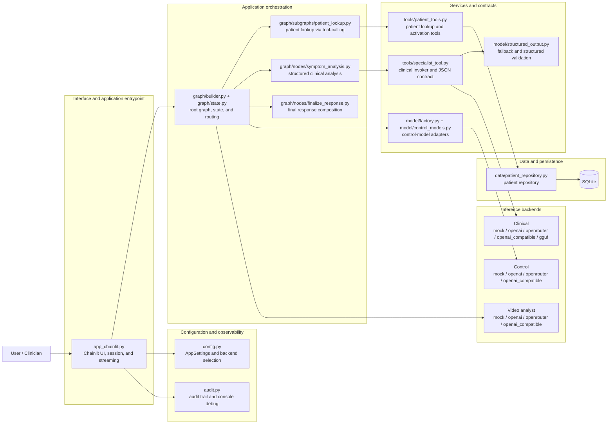
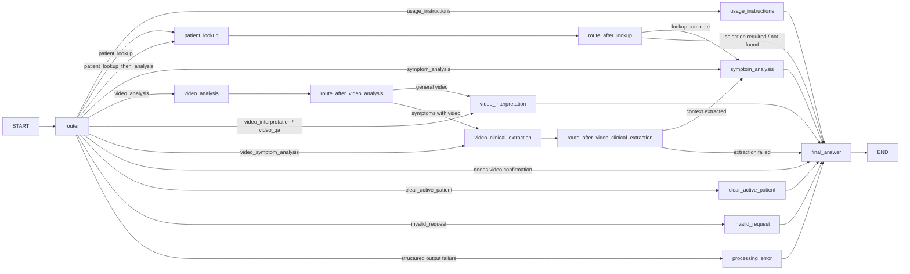

# Screening Robot

[](https://www.python.org/)
[](https://docs.langchain.com/oss/python/langgraph/overview)
[](https://docs.chainlit.io/)
[](https://unsloth.ai/docs)
[](https://huggingface.co/luizaaca)

🇧🇷 [Read in Portuguese](README_pt-br.md)

Clinical triage assistant that connects **fine-tuned Qwen models**, a **LangGraph orchestration layer**, a **Chainlit conversational interface**, and **SQLite-based patient retrieval** into a single end-to-end project.

The project covers the full lifecycle: dataset engineering, QLoRA fine-tuning, structured clinical inference, patient context retrieval in SQLite, observability, and a modular Python runtime.


## Table of Contents

- [Overview](#overview)
- [Implementation checklist](#implementation-checklist)
- [Architecture at a glance](#architecture-at-a-glance)
- [Fine-tuning pipeline and model evolution](#fine-tuning-pipeline-and-model-evolution)
- [Published models](#published-models)
- [LangGraph assistant runtime](#langgraph-assistant-runtime)
- [Security, validation, and explainability](#security-validation-and-explainability)
- [Repository structure](#repository-structure)
- [Technology stack](#technology-stack)
- [How to run](#how-to-run)
- [Example prompts](#example-prompts)
- [Notebooks, scripts, and datasets](#notebooks-scripts-and-datasets)
- [Testing](#testing)
- [Official references](#official-references)
- [Limitations](#limitations)

## Overview

`Screening Robot` is a clinical triage assistant prototype built on two complementary layers:

1. **Control layer** — routes requests, coordinates tools, performs patient lookup, and composes the final response.
2. **Clinical specialist layer** — produces structured clinical output that the graph can reliably consume.

The project evolved from notebook experiments into a modular Python application in `src/screening_agent/`, with:

- **LangGraph** for stateful orchestration and conditional routing;
- **LangChain** for model, tool, and message abstractions;
- **Chainlit** for the conversational web interface;
- **video_pipeline** for expression, posture, and transcription extraction from uploaded/local videos;
- **Pydantic** for structured outputs and validation;
- **SQLite** for patient context retrieval with structured RAG;
- **Unsloth + QLoRA** for efficient fine-tuning of Qwen models;
- **GGUF compatibility** for local inference.

The project uses public symptom/disease datasets, curated synthetic enrichment, and synthetic patient records in SQLite, enabling reproducible demonstrations without exposing sensitive information.

## Implementation checklist

| Technique | Application | Files |
| --- | --- | --- |
| LLM fine-tuning with clinical data | Training notebooks + custom dataset pipeline | `screening_robot.ipynb`, `screening_robot_qwen3_1_7b_json.ipynb`, `process_clinical_batches.py` |
| Data preprocessing and curation | Normalization + synthetic data strategy | `process_clinical_batches.py`, `dataset_augmentation.ipynb`, `seed_demo_data.py`, synthetic SQLite database |
| LangChain-based assistant | Model/tool abstractions and prompt-driven workflow | `src/screening_agent/model/`, `src/screening_agent/tools/`, `src/screening_agent/prompts/` |
| LangGraph orchestration | Graph with state, subgraphs, and conditional edges | `src/screening_agent/graph/` |
| Structured data access | SQLite retrieval and patient activation flow | `src/screening_agent/data/patient_repository.py`, `src/screening_agent/tools/patient_tools.py` |
| Video analysis | Video upload/path handling, pipeline execution, narrative interpretation, and lazy clinical extraction | `app_chainlit.py`, `src/video_pipeline/`, `src/screening_agent/graph/nodes/video.py` |
| Security and validation | Fail-closed behavior, disclaimers, retries, schema validation | `src/screening_agent/model/structured_output.py`, `src/screening_agent/graph/nodes/processing_error.py` |
| Observability and auditing | Log events + debug modes | `src/screening_agent/audit.py`, `.env.example` |
| Explainability and traceability | Router rationale, structured output, patient context | `src/screening_agent/graph/state.py`, `specialist_tool.py`, `finalize_response.py` |

## Architecture at a glance

The project is composed of **six functional blocks**: interface, configuration/observability, orchestration, services and contracts, data/persistence, and inference backends. This view shows how the repository modules fit together.



### Main blocks

**Interface and application entrypoint**
- `app_chainlit.py` is the Chainlit entrypoint.
- The UI creates or reuses a per-session `thread_id`, loads `AppSettings`, compiles the graph with `build_default_graph(...)`, and streams only the tokens generated by the `final_answer` node.
- The interface does not embed clinical or lookup business rules; it delegates each turn to the orchestrated runtime.

**Configuration and observability**
- `config.py` centralizes environment-driven configuration: SQLite database, control backend, clinical backend, checkpoint mode, and debug level.
- `audit.py` concentrates audit events and console-debug emission across the workflow.
- These modules are cross-cutting concerns rather than business-flow components.

**Application orchestration**
- `src/screening_agent/graph/` implements the main LangGraph runtime.
- `src/screening_agent/prompts/` centralizes the system prompts consumed by nodes and subflows.
- The root graph coordinates routing, usage instructions, patient lookup, symptom analysis, context clearing, error handling, and final response composition.
- Video analysis is handled by graph nodes that call `src/video_pipeline`, store compact JSON plus a text summary in state, send narrative interpretation to a dedicated video analyst backend, and perform structured clinical extraction only for symptom-analysis flows.
- Patient lookup and clinical analysis are encapsulated as specialized subflows while sharing the same session state.

**Services and contracts**
- The **control model** does more than intent classification: it also drives tool-calling, support nodes, and final response rendering.
- The **clinical invoker** in `tools/specialist_tool.py` encapsulates the `ClinicalScreeningOutput` contract and abstracts the configured clinical backend.
- `tools/patient_tools.py` implements security-number lookup, name search, and patient activation operations.
- `model/structured_output.py` adds fallback and JSON repair for remote specialist backends; the `mock` and `gguf` paths validate outputs through their own mechanisms.

**Inference backends**
- The **control** path supports `mock`, `openai`, `openrouter`, and `openai_compatible`.
- The **clinical** path supports `mock`, `openai`, `openrouter`, `openai_compatible`, and `gguf`.
- The fine-tuned Qwen artifacts belong to the clinical path; they are not an architectural requirement for the control path.

**Data and persistence**
- `data/patient_repository.py` provides structured SQLite access for fictional security-number lookup, name search, and clinical-context retrieval.
- The repository operates on synthetic patient data and feeds the active context used during clinical analysis.
- This is structured retrieval over SQLite, not a vector index.

### Important architectural relationships

- Chainlit is the presentation layer; the main logic lives in the graph and service modules.
- LangGraph is the application runtime and state coordinator; it does not replace the data layer or the model-integration layer.
- Patient lookup and clinical analysis both use tool-calling, but they represent different business responsibilities.
- Final-answer composition is a separate step that turns internal artifacts into the text shown to the user.

For details on node routing and LangGraph flow, see the **LangGraph assistant runtime** section below.

### Assistant state

The runtime extends LangGraph's `MessagesState` with assistant-specific fields such as:

- `active_patient`
- `patient_lookup_status`
- `patient_lookup_candidates`
- `router_intent`
- `router_rationale`
- `specialist_output_json`
- `pending_video_request`
- `video_input_status`
- `incoming_video_path`
- `video_path`
- `video_artifact_path`
- `video_artifact_dir`
- `video_analysis_summary`
- `video_analysis_json`
- `video_analysis_status`
- `video_interpretation`
- `video_clinical_context_json`
- `turn_outcome`
- `last_response`

This state design allows the assistant to preserve short-term context across turns without hard-coding business logic into the UI layer.

## Fine-tuning pipeline and model evolution

The project contains **two fine-tuning generations**, and the difference between them is central to understanding the final solution.

### Version 1 — `screening_robot.ipynb`

The first notebook fine-tunes **Qwen3-0.6B** with QLoRA in a symptom-to-disease formulation where the model returns a final textual answer with a fixed clinical disclaimer.

Key characteristics:

- lighter base model for fast experimentation;
- mixed `/think` and `/no_think` prompting styles;
- evaluation with **accuracy**, **macro-F1**, **Cohen's Kappa**, **confusion matrices**, and **BERTScore**;
- LoRA + GGUF export path.

Why it was not selected for the final agent:

- the reasoning behavior was not sufficiently consolidated for downstream orchestration;
- the disclaimer-oriented free-text shape was hard to integrate reliably as a specialist tool;
- free-form answers were harder to validate and to use in a tool-calling agent.

### Version 2 — `screening_robot_qwen3_1_7b_json.ipynb`

The second notebook fine-tunes **Qwen3-1.7B-Base** with **Unsloth + QLoRA** for a narrower, production-friendly objective: emitting a validated JSON payload designed for the specialist tool in the runtime. Check in [Colab](https://colab.research.google.com/github/luizaaca/screening_robot/blob/main/screening_robot_qwen3_1_7b_json.ipynb)

Target schema:

```json
{
  "support_status": "supported | inconclusive",
  "candidate_diseases": ["..."],
  "recommended_exams_tests": ["..."]
}
```

Why this version became the chosen model:

- **better alignment with the agent design**;
- **structured output is easier to validate, retry, and audit**;
- **1.7B parameters offered a better trade-off** between capacity and local efficiency for the intended use case;
- it integrates naturally with the `run_symptom_specialist` tool and the `final_answer` composition step.

### Dataset engineering and curation

The training data is produced by a multi-step enrichment pipeline rather than a single raw CSV.

1. Merge symptom/disease sources into `combined_diseases_symptoms_2.csv`.
2. Run `process_clinical_batches.py` with scraping on [nhs.uk](https://www.nhs.uk/search) to generate:
   - `support_status`
   - `candidate_diseases`
   - `recommended_exams_tests`
   - `reasoning`
3. Persist the enriched artifact to `combined_diseases_symptoms_2_enriched_with_exams_v2.csv`.
4. Publish the resulting dataset to Kaggle: [`luizaaca/symptoms-to-diseases-with-reasoning`](https://www.kaggle.com/datasets/luizaaca/symptoms-to-diseases-with-reasoning).

The enrichment pipeline includes:

- symptom normalization;
- heuristic support scoring;
- TF-IDF-style symptom weighting;
- web-assisted exam suggestion gathering;
- stable disease-candidate ordering;
- curation for structured downstream training.

For the runtime, patient records are intentionally **synthetic** and stored in SQLite. Demo records use fictional identifiers and narrative clinical context so the repository can be published safely.

### Training configuration used in the 1.7B JSON experiment

| Parameter | Value |
| --- | --- |
| Base model | `Qwen/Qwen3-1.7B-Base` |
| Fine-tuning method | QLoRA with Unsloth |
| Quantization | 4-bit |
| LoRA rank | 16 |
| LoRA alpha | 32 |
| Max sequence length | 1024 |
| Batch size | 2 |
| Gradient accumulation | 4 |
| Warmup steps | 20 |
| Max steps | 400 |
| Learning rate | `2e-4` |
| Weight decay | `0.01` |
| Loss masking | response-only supervision |

### Evaluation methodology

Notebooks assess both predictive quality and operational reliability.

**Clinical prediction metrics**

- Accuracy
- F1-macro
- Cohen's Kappa
- Confusion matrix analysis
- BERTScore

**Structured-output reliability metrics**

- JSON parse rate
- Schema validation rate
- `support_status` validity
- presence of the target disease in `candidate_diseases`
- non-empty recommended-exam list rate

Final model selection considered both task performance and **schema adherence / downstream compatibility with the LangGraph agent**.

## Published models

The fine-tuned models are published on Hugging Face and are referenced from this repository.

| Model | Link | Purpose | Output style |
| --- | --- | --- | --- |
| Qwen3-0.6B Clinical Screening | [`luizaaca/qwen3-0.6b-clinical-screening`](https://huggingface.co/luizaaca/qwen3-0.6b-clinical-screening) | First iteration to validate the problem framing | Free-form clinical answer with a fixed disclaimer |
| Qwen3-1.7B Clinical Screening | [`luizaaca/qwen3-1.7b-clinical-screening`](https://huggingface.co/luizaaca/qwen3-1.7b-clinical-screening) | Final specialist-oriented model for structured agent integration | Structured clinical JSON aligned with tool calling |

Notes:

- both Hugging Face model pages list the artifacts under **CC-BY-4.0**;
- local inference can use a **GGUF export** configured via `SCREENING_AGENT_GGUF_MODEL_PATH`;
- the runtime keeps the **control** and **clinical** models logically independent.

## LangGraph assistant runtime

The runtime graph is implemented in `src/screening_agent/graph/` and compiled by `build_default_graph(...)`.



### Main nodes and subgraphs

| Component | Responsibility |
| --- | --- |
| `router` | Classifies the request intent with structured output (`RouteDecision`) |
| `usage_instructions` | Explains how the assistant should be used |
| `patient_lookup` | Runs the patient retrieval tool flow |
| `route_after_lookup` | Decides whether to continue to analysis or answer immediately |
| `symptom_analysis` | Invokes the specialist tool and captures structured clinical output |
| `video_analysis` | Runs `src/video_pipeline.process_video(...)`, stores JSON/summary, and writes artifacts |
| `route_after_video_analysis` | Decides whether a processed video needs narrative interpretation or clinical extraction |
| `video_interpretation` | Produces narrative video interpretation, optionally including active patient context |
| `video_clinical_extraction` | Lazily extracts compact clinical video context only for symptom-analysis flows |
| `route_after_video_clinical_extraction` | Continues to symptom analysis only when structured video context is available |
| `clear_active_patient` | Safely clears patient context |
| `invalid_request` | Handles unsupported requests |
| `processing_error` | Fail-closed fallback for orchestration failures |
| `final_answer` | Composes the final clinician-facing response |

### Retrieval-augmented patient context

The patient lookup flow is structured retrieval over SQLite (RAG-style for clinical context):

- `find_by_security_number(...)` retrieves a patient by fictional identifier;
- `search_by_name(...)` ranks results by exact match, prefix match, and substring match;
- `activate_patient_selection(...)` resolves name ambiguity across turns;
- the retrieved `clinical_context` is injected into the symptom-analysis workflow.

The seeded demo database contains **six synthetic patients** and can be initialized with `python seed_demo_data.py`.

### Specialist tool and backends

The specialist tool is implemented in `src/screening_agent/tools/specialist_tool.py` and supports multiple execution strategies:

1. **mock** — deterministic offline behavior for development and tests;
2. **remote structured model** — OpenAI / OpenRouter / OpenAI-compatible endpoints;
3. **GGUF local runtime** — for local inference using a GGUF artifact.

Supported backends matrix:

| Layer | Supported backends |
| --- | --- |
| Control model | `mock`, `openai`, `openrouter`, `openai_compatible` |
| Clinical model | `mock`, `openai`, `openrouter`, `openai_compatible`, `gguf` |
| Video analyst model | `mock`, `openai`, `openrouter`, `openai_compatible` |

### Video workflow

The Chainlit app accepts videos in two ways:

- upload a video file in the chat UI;
- send a local path in the message, for example `video_path=concepts_video/sample.mp4` or `path: C:/videos/sample.mp4`.

Chainlit only handles message I/O, upload, timeout/cancelation, token streaming, and visual progress. The graph decides whether a video is needed. If a request needs video but no active video, upload, or path is available, `final_answer` asks for confirmation first; only a positive confirmation activates `AskFileMessage`. The uploaded file then reinvokes the graph with the pending request.

Direct upload or a valid local path skips confirmation and runs the real `process_video(...)` path immediately. General video uploads flow through `video_analysis -> video_interpretation -> final_answer`. Symptom-analysis requests based on video flow through `video_analysis -> video_clinical_extraction -> symptom_analysis -> final_answer`; `video_clinical_context_json` is created only in that path. Later general questions about the same active video reuse the stored pipeline artifacts and do not trigger clinical extraction.

Processed outputs are written under `SCREENING_AGENT_VIDEO_PIPELINE_OUTPUT_DIR/{thread_id}`. The default graph state keeps a compact summary plus serialized JSON; debug sidecars stay in the pipeline artifact directory. Chainlit progress uses sanitized `cl.Step` entries for main graph nodes only; prompts, raw clinical payloads, and full video JSON remain out of default UI steps.

## Security, validation, and explainability

Healthcare systems need strong guardrails.

### Safety boundaries

- the assistant is presented as a **clinical screening support tool**, not a definitive diagnostic mechanism;
- final responses include an explicit disclaimer that the system **does not replace professional judgment**;
- invalid or out-of-scope requests are routed to dedicated containment responses.

### Fail-closed structured output

`ResilientStructuredOutputInvoker`, in `src/screening_agent/model/structured_output.py`, uses a bounded retry strategy:

1. native structured-output attempt;
2. JSON-repair fallback;
3. final JSON-repair attempt;
4. bounded error and deterministic failure path.

This avoids silent corruption when the model drifts from the expected schema.

### Audit trail and debug modes

Audit events are emitted throughout the workflow with fields such as:

- `timestamp_utc`
- `event_type`
- `status`
- `node_name`
- `detail`

Console debug modes:

- `SCREENING_AGENT_CONSOLE_DEBUG_MODE=none`
- `SCREENING_AGENT_CONSOLE_DEBUG_MODE=info`
- `SCREENING_AGENT_CONSOLE_DEBUG_MODE=debug`

Sensitive values such as security numbers are masked before being printed to the console.

### Explainability features

The runtime preserves interpretable intermediate artifacts:

- router rationale is kept in state;
- the specialist output explicitly exposes `support_status`, `candidate_diseases`, and `recommended_exams_tests`;
- patient context comes from a known repository source;
- final responses are composed from structured upstream artifacts.

## Repository structure

```text
.
├── app_chainlit.py
├── process_clinical_batches.py
├── screening_robot.ipynb
├── screening_robot_qwen3_1_7b_json.ipynb
├── langgraph_router_specialists_simple.ipynb
├── langgraph_router_specialists_simple_v2.ipynb
├── langgraph_router_specialists_simple_v3.ipynb
├── seed_demo_data.py
├── src/
│   └── screening_agent/
│       ├── audit.py
│       ├── config.py
│       ├── data/
│       ├── graph/
│       ├── model/
│       ├── prompts/
│       └── tools/
└── tests/
```

### Key folders

- `src/screening_agent/data/` — SQLite schema, repository, and demo seeding helpers
- `src/screening_agent/graph/` — state schema, graph builder, nodes, and subgraphs
- `src/screening_agent/model/` — model adapters, mock runtime, structured-output fallback
- `src/screening_agent/prompts/` — system prompts by responsibility
- `src/screening_agent/tools/` — patient lookup tools and clinical specialist tool
- `tests/` — deterministic automated coverage for the core runtime

## Technology stack

### Runtime dependencies

- `chainlit>=2.11.1`
- `langchain>=1.2.15`
- `langgraph>=1.1.10`
- `langchain-openai>=1.2.1`
- `langchain-openrouter>=0.2.1`
- `openai>=2.32.0`
- `pydantic>=2.13.2`
- `python-dotenv>=1.2.2`

### Training and evaluation stack

- Unsloth
- PyTorch
- TRL / SFTTrainer
- scikit-learn
- evaluate / BERTScore
- pandas / NumPy / seaborn / matplotlib
- llama-cpp-python (for GGUF runtime experiments)

## How to run

### Prerequisites

- Python **3.13+**
- virtual environment support
- Git
- an optional model endpoint or local GGUF artifact if you want real inference instead of mock mode

### Installation

```bash
python -m venv .venv
source .venv/Scripts/activate
pip install -e .[dev]
```

Install optional video dependencies when you want the real video pipeline:

```bash
pip install -e .[dev,video]
```

### Configuration

Copy `.env.example` to `.env` and configure the model backends as desired.

Important variables:

- `SCREENING_AGENT_CONTROL_BACKEND`
- `SCREENING_AGENT_CONTROL_MODEL`
- `SCREENING_AGENT_CLINICAL_BACKEND`
- `SCREENING_AGENT_CLINICAL_MODEL`
- `SCREENING_AGENT_VIDEO_ANALYST_BACKEND`
- `SCREENING_AGENT_VIDEO_ANALYST_MODEL`
- `SCREENING_AGENT_VIDEO_PIPELINE_OUTPUT_DIR`
- `SCREENING_AGENT_VIDEO_UPLOAD_MAX_MB`
- `SCREENING_AGENT_GGUF_MODEL_PATH`
- `SCREENING_AGENT_USE_IN_MEMORY_CHECKPOINTER=true`
- `SCREENING_AGENT_CONSOLE_DEBUG_MODE`

Default safe demo configuration:

```env
SCREENING_AGENT_CONTROL_BACKEND=mock
SCREENING_AGENT_CLINICAL_BACKEND=mock
SCREENING_AGENT_VIDEO_ANALYST_BACKEND=mock
SCREENING_AGENT_USE_IN_MEMORY_CHECKPOINTER=true
```

### Seed the demo database

```bash
python seed_demo_data.py
```

### Run the application

```bash
chainlit run app_chainlit.py
```

Open the local Chainlit URL shown in the terminal and start chatting.

### Provider switching

Supported setups without code changes:

- **Mock mode** — demos, tests, offline development
- **OpenAI** — hosted inference
- **OpenRouter** — provider-agnostic remote inference
- **OpenAI-compatible** — local/self-hosted endpoints (LM Studio-style)
- **GGUF** — local clinical backend for the specialist tool

- **Video analyst** uses `SCREENING_AGENT_VIDEO_ANALYST_*` and supports `mock`, `openai`, `openrouter`, and `openai_compatible`

See `.env.example` for concrete examples.

## Example prompts

- `Find patient Maria Silva`
- `Lookup patient 12003456`
- `Patient 55667788 has fatigue and frequent urination`
- `Analyze this video with video_path=concepts_video/sample.mp4`
- `What posture or expression patterns appear in the uploaded video?`
- `Clear active patient`
- `How should I use this assistant?`

## Notebooks, scripts, and datasets

| Artifact | Purpose |
| --- | --- |
| `screening_robot.ipynb` | First end-to-end fine-tuning experiment with Qwen3-0.6B |
| `screening_robot_qwen3_1_7b_json.ipynb` | Final structured-output fine-tuning experiment with Qwen3-1.7B |
| `langgraph_router_specialists_simple.ipynb` | Minimal LangGraph routing concept |
| `langgraph_router_specialists_simple_v2.ipynb` | Intermediate notebook with richer patient context and backend flexibility |
| `langgraph_router_specialists_simple_v3.ipynb` | Production-oriented pattern for structured specialist integration |
| `dataset_augmentation.ipynb` | LLM-assisted dataset validation and augmentation experiments |
| `process_clinical_batches.py` | Batch enrichment pipeline for support status, candidates, exams, and reasoning |
| `combined_diseases_symptoms_2_enriched_with_exams_v2.csv` | Enriched custom training dataset |
| `data/patients.sqlite3` | Synthetic patient database used by the app |

## Testing

Run the automated test suite with:

```bash
python -m pytest tests/
```

Current tests cover:

- patient repository lookups and ranking behavior;
- graph routing and node transitions;
- end-to-end mock-mode conversations;
- video path/upload parsing, video settings, video graph processing, video interpretation, and lazy clinical extraction;
- structured-output fallback logic;
- demo data seeding;
- state helpers and console debug behavior.

## Official references

- LangChain overview: <https://docs.langchain.com/oss/python/langchain/overview>
- LangGraph overview: <https://docs.langchain.com/oss/python/langgraph/overview>
- LangGraph graph API: <https://docs.langchain.com/oss/python/langgraph/graph-api>
- Chainlit overview: <https://docs.chainlit.io/>
- Chainlit installation: <https://docs.chainlit.io/get-started/installation>
- Unsloth documentation: <https://unsloth.ai/docs>
- Pydantic documentation: <https://pydantic.dev/docs/validation/latest/get-started/>
- Qwen organization on Hugging Face: <https://huggingface.co/Qwen>
- Hugging Face model repository — Qwen3-0.6B clinical screening: <https://huggingface.co/luizaaca/qwen3-0.6b-clinical-screening>
- Hugging Face model repository — Qwen3-1.7B clinical screening: <https://huggingface.co/luizaaca/qwen3-1.7b-clinical-screening>
- Kaggle dataset — symptoms to diseases with reasoning: <https://www.kaggle.com/datasets/luizaaca/symptoms-to-diseases-with-reasoning>

## Limitations

- This is **not** a medical device and must not be used as a substitute for a licensed clinician.
- Video outputs are screening-support artifacts only; expression, posture, and transcription evidence must not be treated as definitive diagnosis.
- Real video processing requires optional heavy dependencies installed with `.[video]` and may fail closed when model assets or media codecs are unavailable.
- The public repository uses **synthetic patient records** and public datasets rather than real hospital data.
- The retrieval layer is **structured SQLite retrieval**, not a vector-search knowledge base.
- Production concerns such as authentication, long-term persistence, and deployment hardening are intentionally out of scope for this version.

To explore the project, start with `langgraph_router_specialists_simple_v3.ipynb` to understand how the agent works with LangGraph, then `screening_robot_qwen3_1_7b_json.ipynb` to review the final model training pipeline, and `app_chainlit.py` for the conversational interface.
