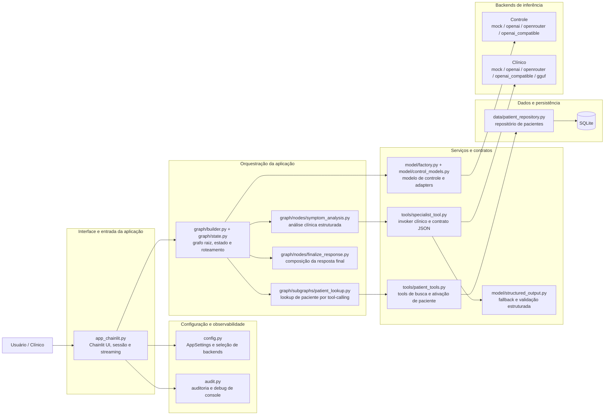
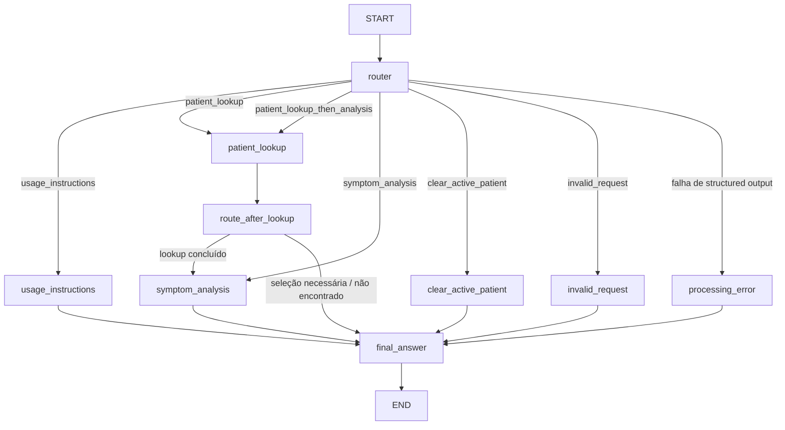

# Screening Robot

[](https://www.python.org/)
[](https://docs.langchain.com/oss/python/langgraph/overview)
[](https://docs.chainlit.io/)
[](https://unsloth.ai/docs)
[](https://huggingface.co/luizaaca)

🇺🇸 [Read in English](README.md)

Assistente de triagem clínica que conecta **modelos Qwen fine-tuned**, uma camada de **orquestração com LangGraph**, uma **interface conversacional em Chainlit** e **recuperação de contexto de pacientes em SQLite** em um único projeto ponta a ponta.

O projeto cobre o ciclo completo: engenharia de dataset, fine-tuning com QLoRA, inferência clínica estruturada, contexto de paciente com recuperação de dados em SQLite, observabilidade e um runtime Python modular.

## Sumário

- [Visão geral](#visão-geral)
- [Arquitetura e checklist de implementação](#arquitetura-e-checklist-de-implementação)
- [Arquitetura em alto nível](#arquitetura-em-alto-nível)
- [Pipeline de fine-tuning e evolução dos modelos](#pipeline-de-fine-tuning-e-evolução-dos-modelos)
- [Modelos publicados](#modelos-publicados)
- [Runtime do assistente com LangGraph](#runtime-do-assistente-com-langgraph)
- [Segurança, validação e explicabilidade](#segurança-validação-e-explicabilidade)
- [Estrutura do repositório](#estrutura-do-repositório)
- [Stack tecnológica](#stack-tecnológica)
- [Como executar](#como-executar)
- [Prompts de exemplo](#prompts-de-exemplo)
- [Notebooks, scripts e datasets](#notebooks-scripts-e-datasets)
- [Testes](#testes)
- [Referências oficiais](#referências-oficiais)
- [Limitações](#limitações)

## Visão geral

`Screening Robot` é um protótipo de assistente de triagem clínica construído sobre duas camadas complementares:

1. **Camada de controle** — roteia solicitações, coordena ferramentas, faz lookup de paciente e compõe a resposta final.
2. **Camada especialista clínica** — produz saída clínica estruturada, confiável para consumo pelo grafo.

O projeto evoluiu de experimentos em notebook para uma aplicação Python modular em `src/screening_agent/`, com:

- **LangGraph** para orquestração com estado e roteamento condicional;
- **LangChain** para abstrações de modelos, tools e mensagens;
- **Chainlit** para a interface web conversacional;
- **Pydantic** para schemas e validação de saída estruturada;
- **SQLite** para contexto de paciente com RAG estruturado;
- **Unsloth + QLoRA** para fine-tuning eficiente dos modelos Qwen;
- **compatibilidade com GGUF** para inferência local.

O projeto utiliza datasets públicos de sintomas/doenças, enriquecimento sintético curado e registros sintéticos de pacientes em SQLite, possibilitando demonstrações reproduzíveis sem expor informações sensíveis.

## Arquitetura e checklist de implementação

| Técnica | Aplicação | Arquivos |
| --- | --- | --- |
| Fine-tuning de LLM com dados clínicos | Notebooks de treino + pipeline de dataset customizado | `screening_robot.ipynb`, `screening_robot_qwen3_1_7b_json.ipynb`, `process_clinical_batches.py` |
| Preprocessing e curadoria de dados | Normalização + estratégia com dados sintéticos | `process_clinical_batches.py`, `dataset_augmentation.ipynb`, `seed_demo_data.py`, base SQLite sintética |
| Assistente com LangChain | Abstrações de modelo/tool e fluxo por prompts | `src/screening_agent/model/`, `src/screening_agent/tools/`, `src/screening_agent/prompts/` |
| Orquestração com LangGraph | Grafo com estado, subgrafos e arestas condicionais | `src/screening_agent/graph/` |
| Acesso a base estruturada | Recuperação SQLite e ativação de contexto de paciente | `src/screening_agent/data/patient_repository.py`, `src/screening_agent/tools/patient_tools.py` |
| Segurança e validação | Fail-closed, disclaimers, retries, validação por schema | `src/screening_agent/model/structured_output.py`, `src/screening_agent/graph/nodes/processing_error.py` |
| Observabilidade e auditoria | Eventos de log + modos de debug | `src/screening_agent/audit.py`, `.env.example` |
| Explainability e rastreabilidade | Racional do router, saída estruturada, contexto do paciente | `src/screening_agent/graph/state.py`, `specialist_tool.py`, `finalize_response.py` |

## Arquitetura em alto nível

O projeto é uma composição de **seis blocos funcionais**: interface, configuração/observabilidade, orquestração, serviços e contratos, dados/persistência e backends de inferência. Esta visão mostra como os módulos do repositório se encaixam.



### Blocos principais

**Interface e entrada da aplicação**
- `app_chainlit.py` é a porta de entrada da interface em Chainlit.
- A UI cria ou reutiliza um `thread_id` por sessão, carrega `AppSettings`, compila o grafo com `build_default_graph(...)` e transmite apenas os tokens gerados pelo nó `final_answer`.
- A interface não contém regras clínicas nem regras de lookup; ela apenas entrega cada turno ao runtime orquestrado.

**Configuração e observabilidade**
- `config.py` centraliza a configuração por ambiente: banco SQLite, backend do modelo de controle, backend clínico, modo de checkpoint e nível de debug.
- `audit.py` concentra auditoria e emissão de eventos de console ao longo do fluxo.
- Esses módulos são transversais: participam da aplicação inteira, mas não implementam a lógica de negócio em si.

**Orquestração da aplicação**
- `src/screening_agent/graph/` implementa o runtime principal em LangGraph.
- `src/screening_agent/prompts/` concentra os prompts de sistema usados pelos nós e subfluxos.
- O grafo raiz coordena roteamento, instruções de uso, lookup de paciente, análise de sintomas, limpeza de contexto, tratamento de erro e composição da resposta final.
- O lookup de paciente e a análise clínica são encapsulados como subfluxos especializados, mas continuam subordinados ao mesmo estado de sessão.

**Serviços e contratos**
- O **modelo de controle** não serve apenas para classificar intenção: ele também dirige tool-calling, nós de suporte e a composição textual da resposta final.
- O **invoker clínico** em `tools/specialist_tool.py` encapsula o contrato estruturado `ClinicalScreeningOutput` e abstrai o backend clínico configurado.
- `tools/patient_tools.py` implementa as operações de busca por identificador, busca por nome e ativação de paciente no estado.
- `model/structured_output.py` adiciona fallback e reparo JSON para backends remotos; já os caminhos `mock` e `gguf` validam a saída por mecanismos próprios.

**Backends de Inferência**
- O backend de **controle** suporta `mock`, `openai`, `openrouter` e `openai_compatible`.
- O backend **clínico** suporta `mock`, `openai`, `openrouter`, `openai_compatible` e `gguf`.
- Os modelos Qwen fine-tuned pertencem ao caminho clínico; eles não são usados na camada de controle.

**Dados e persistência**
- `data/patient_repository.py` oferece acesso estruturado ao SQLite com busca por número identificador, busca por nome e recuperação do contexto clínico.
- O repositório opera sobre dados sintéticos e alimenta o contexto ativo usado na etapa de análise clínica.
- Trata-se de recuperação estruturada sobre SQLite, não de um índice vetorial.

### Relações arquiteturais importantes

- O Chainlit é a camada de apresentação; a lógica principal vive no grafo e nos serviços.
- O LangGraph é o runtime de aplicação e coordenação de estado; ele não substitui a camada de dados nem a camada de integração com modelos.
- O lookup de paciente e a análise clínica usam tool-calling, mas representam responsabilidades de negócio distintas.
- A composição da resposta final é uma etapa separada, responsável por transformar artefatos internos em texto exibido ao usuário.

Para detalhes do roteamento e fluxo de nós no LangGraph, consulte a seção **Runtime do assistente com LangGraph** abaixo.


## Pipeline de fine-tuning e evolução dos modelos

O projeto contém **duas gerações de fine-tuning**, e a diferença entre elas é central para entender a solução final.

### Versão 1 — `screening_robot.ipynb`

O primeiro notebook faz fine-tuning do **Qwen3-0.6B** com QLoRA em uma formulação sintoma → doença na qual o modelo produz uma resposta final com um disclaimer clínico fixo.

Características principais:

- modelo base leve para experimentação rápida;
- prompting misto com estilos `/think` e `/no_think`;
- avaliação com **accuracy**, **macro-F1**, **Cohen's Kappa**, **matriz de confusão** e **BERTScore**;
- exportação em LoRA + GGUF.

Por que ele não foi o modelo escolhido para o agente final:

- o comportamento de reasoning não foi incorporado com a força necessária para a orquestração posterior;
- o formato de resposta focado em disclaimer não se encaixou bem em uma tool especialista dentro do LangGraph;
- respostas livres eram mais difíceis de validar e integrar com confiabilidade em um agente tool-calling.

### Versão 2 — `screening_robot_qwen3_1_7b_json.ipynb`

O segundo notebook faz fine-tuning do **Qwen3-1.7B-Base** com **Unsloth + QLoRA** para um objetivo muito mais focado: emitir um payload JSON validável, desenhado especificamente para a tool especialista usada no runtime.

Schema alvo:

```json
{
  "support_status": "supported | inconclusive",
  "candidate_diseases": ["..."],
  "recommended_exams_tests": ["..."]
}
```

Por que essa versão virou a preferida do assistente:

- **maior alinhamento com o desenho agentic**;
- **saída estruturada é mais fácil de validar, repetir e auditar**;
- **1.7B parâmetros entregou um trade-off melhor** entre capacidade e eficiência local;
- integração natural com a tool `run_symptom_specialist` e com o passo de composição em `final_answer`.

### Engenharia e curadoria do dataset

Os dados de treino não vieram de um CSV único “cru”. O pipeline combinou datasets públicos com passos de enriquecimento customizados:

1. Combinação de fontes sintoma/doença em `combined_diseases_symptoms_2.csv`.
2. Execução de `process_clinical_batches.py` com scraping no site da [nhs.uk](https://www.nhs.uk/search) para gerar:
   - `support_status`
   - `candidate_diseases`
   - `recommended_exams_tests`
   - `reasoning`
3. Persistência em `combined_diseases_symptoms_2_enriched_with_exams_v2.csv`.
4. Publicação no Kaggle: [`luizaaca/symptoms-to-diseases-with-reasoning`](https://www.kaggle.com/datasets/luizaaca/symptoms-to-diseases-with-reasoning).

Esse pipeline inclui:

- normalização de sintomas;
- scoring heurístico de suporte;
- pesos estilo TF-IDF para sintomas;
- coleta assistida por web para exames sugeridos;
- ordenação estável de doenças candidatas;
- curadoria para treino estruturado downstream.

Na camada da aplicação, os dados de paciente são propositalmente **sintéticos** e armazenados em SQLite. Os registros demo usam identificadores fictícios e contexto clínico narrativo para que o repositório possa ser publicado sem expor dados reais.

### Configuração de treino usada no experimento JSON 1.7B

| Parâmetro | Valor |
| --- | --- |
| Modelo base | `Qwen/Qwen3-1.7B-Base` |
| Método de fine-tuning | QLoRA com Unsloth |
| Quantização | 4-bit |
| LoRA rank | 16 |
| LoRA alpha | 32 |
| Comprimento máximo de sequência | 1024 |
| Batch size | 2 |
| Gradient accumulation | 4 |
| Warmup steps | 20 |
| Max steps | 400 |
| Learning rate | `2e-4` |
| Weight decay | `0.01` |
| Máscara de loss | supervisão apenas na resposta |

### Metodologia de avaliação

Os notebooks avaliam tanto qualidade preditiva quanto confiabilidade operacional.

**Métricas clínicas**

- Accuracy
- F1-macro
- Cohen's Kappa
- Análise por matriz de confusão
- BERTScore

**Métricas de confiabilidade da saída estruturada**

- taxa de parse de JSON
- taxa de validação por schema
- validade de `support_status`
- presença da doença-alvo em `candidate_diseases`
- taxa de lista não vazia de exames recomendados

A escolha final do modelo considerou não só o comportamento bruto de classificação, mas também **aderência ao schema e compatibilidade downstream com o agente em LangGraph**.

## Modelos publicados

Os modelos treinados foram publicados no Hugging Face e podem ser referenciados diretamente a partir deste repositório.

| Modelo | Link | Finalidade | Estilo de saída |
| --- | --- | --- | --- |
| Qwen3-0.6B Clinical Screening | [`luizaaca/qwen3-0.6b-clinical-screening`](https://huggingface.co/luizaaca/qwen3-0.6b-clinical-screening) | Primeira iteração de fine-tuning para validar o enquadramento do problema | Resposta clínica em texto livre com disclaimer fixo |
| Qwen3-1.7B Clinical Screening | [`luizaaca/qwen3-1.7b-clinical-screening`](https://huggingface.co/luizaaca/qwen3-1.7b-clinical-screening) | Modelo final orientado à tool especialista e à integração com o agente | JSON clínico estruturado, alinhado a tool calling |

Observações:

- as duas páginas de modelo no Hugging Face expõem os artefatos com **CC-BY-4.0** nas respectivas páginas;
- a inferência local na aplicação pode usar uma rota **GGUF** configurada por `SCREENING_AGENT_GGUF_MODEL_PATH`;
- a arquitetura permite manter **modelo de controle** e **modelo clínico especialista** independentes.

## Runtime do assistente com LangGraph

O grafo principal está em `src/screening_agent/graph/` e é compilado por `build_default_graph(...)`.



### Nós principais e subgrafos

| Componente | Responsabilidade |
| --- | --- |
| `router` | Classifica a intenção da requisição com saída estruturada (`RouteDecision`) |
| `usage_instructions` | Explica como o assistente deve ser usado |
| `patient_lookup` | Executa o fluxo de recuperação de paciente |
| `route_after_lookup` | Decide se segue para análise ou responde imediatamente |
| `symptom_analysis` | Chama a tool especialista e captura a saída clínica estruturada |
| `clear_active_patient` | Limpa o contexto de paciente com segurança |
| `invalid_request` | Trata pedidos fora de escopo |
| `processing_error` | Fallback fail-closed para falhas de orquestração |
| `final_answer` | Compõe a resposta final exibida ao clínico |

### Estado do assistente

O runtime estende `MessagesState` do LangGraph com campos específicos do domínio, como:

- `active_patient`
- `patient_lookup_status`
- `patient_lookup_candidates`
- `router_intent`
- `router_rationale`
- `specialist_output_json`
- `last_response`


### Contextualização com recuperação de dados do paciente

O fluxo de patient lookup funciona como uma camada de RAG estruturado sobre SQLite.

- `find_by_security_number(...)` recupera um paciente por ID fictício;
- `search_by_name(...)` ranqueia resultados por match exato, prefixo e substring;
- `activate_patient_selection(...)` resolve ambiguidade de nomes entre turnos;
- o `clinical_context` recuperado é injetado no fluxo de análise de sintomas.

A base demo possui **seis pacientes sintéticos** e pode ser inicializada com `python seed_demo_data.py`.

### Tool especialista e backends

A tool especialista está em `src/screening_agent/tools/specialist_tool.py` e suporta três estratégias de execução:

1. **mock** — comportamento determinístico e offline para desenvolvimento e testes;
2. **modelo remoto estruturado** — OpenAI / OpenRouter / OpenAI-compatible;
3. **runtime GGUF local** — para inferência local a partir de um artefato implantado.

Matriz de suporte por camada:

| Camada | Backends suportados |
| --- | --- |
| Modelo de controle | `mock`, `openai`, `openrouter`, `openai_compatible` |
| Modelo clínico | `mock`, `openai`, `openrouter`, `openai_compatible`, `gguf` |

## Segurança, validação e explicabilidade

Sistemas voltados para saúde precisam ser chatos nos lugares certos. Este projeto adiciona guardrails exatamente onde criatividade demais seria um desastre elegante.

### Limites de atuação

- o assistente é apresentado como **ferramenta de suporte à triagem clínica**, não como mecanismo de diagnóstico definitivo;
- as respostas finais incluem disclaimer explícito de que o sistema **não substitui julgamento profissional**;
- requisições inválidas ou fora de escopo são roteadas para respostas específicas de contenção.

### Output estruturado com fail-closed

`ResilientStructuredOutputInvoker`, em `src/screening_agent/model/structured_output.py`, usa uma estratégia de retry limitada:

1. tentativa nativa de structured output;
2. fallback com reparo JSON;
3. tentativa final de reparo JSON;
4. erro delimitado e desvio para caminho determinístico de falha.

Isso evita corrupção silenciosa quando o modelo sai do schema esperado.

### Auditoria e modos de debug

Eventos de auditoria são emitidos ao longo do fluxo com campos como:

- `timestamp_utc`
- `event_type`
- `status`
- `node_name`
- `detail`

O sistema de debug no terminal suporta:

- `SCREENING_AGENT_CONSOLE_DEBUG_MODE=none`
- `SCREENING_AGENT_CONSOLE_DEBUG_MODE=info`
- `SCREENING_AGENT_CONSOLE_DEBUG_MODE=debug`

Valores sensíveis, como números de segurança, são mascarados antes do print em console.

### Recursos de explicabilidade

O runtime preserva estruturas intermediárias interpretáveis em vez de esconder tudo dentro de um prompt gigante:

- o racional do router fica no estado;
- a saída do especialista mantém `support_status`, `candidate_diseases` e `recommended_exams_tests` explícitos;
- o contexto de paciente vem de uma fonte conhecida no repositório;
- a resposta final é composta a partir de artefatos estruturados produzidos anteriormente.

## Estrutura do repositório

```text
.
├── app_chainlit.py
├── process_clinical_batches.py
├── screening_robot.ipynb
├── screening_robot_qwen3_1_7b_json.ipynb
├── langgraph_router_specialists_simple.ipynb
├── langgraph_router_specialists_simple_v2.ipynb
├── langgraph_router_specialists_simple_v3.ipynb
├── seed_demo_data.py
├── src/
│   └── screening_agent/
│       ├── audit.py
│       ├── config.py
│       ├── data/
│       ├── graph/
│       ├── model/
│       ├── prompts/
│       └── tools/
└── tests/
```

### Diretórios principais

- `src/screening_agent/data/` — schema SQLite, repositório e utilitários de seed
- `src/screening_agent/graph/` — schema de estado, builder do grafo, nós e subgrafos
- `src/screening_agent/model/` — adapters de modelo, runtime mock e fallback de structured output
- `src/screening_agent/prompts/` — prompts de sistema por responsabilidade
- `src/screening_agent/tools/` — tools de busca de paciente e tool clínica especialista
- `tests/` — cobertura automatizada determinística do runtime principal

## Stack tecnológica

### Dependências de runtime

- `chainlit>=2.11.1`
- `langchain>=1.2.15`
- `langgraph>=1.1.10`
- `langchain-openai>=1.2.1`
- `langchain-openrouter>=0.2.1`
- `openai>=2.32.0`
- `pydantic>=2.13.2`
- `python-dotenv>=1.2.2`

### Stack de treino e avaliação

- Unsloth
- PyTorch
- TRL / SFTTrainer
- scikit-learn
- evaluate / BERTScore
- pandas / NumPy / seaborn / matplotlib
- llama-cpp-python (para experimentos com runtime GGUF)

## Como executar

### Pré-requisitos

- Python **3.13+**
- suporte a ambiente virtual
- Git
- endpoint de modelo ou artefato GGUF local, caso você queira inferência real em vez do modo mock

### Instalação

```bash
python -m venv .venv
source .venv/Scripts/activate
pip install -e .[dev]
```

### Configuração

Copie `.env.example` para `.env` e ajuste o setup de modelos conforme o backend desejado.

Variáveis importantes:

- `SCREENING_AGENT_CONTROL_BACKEND`
- `SCREENING_AGENT_CONTROL_MODEL`
- `SCREENING_AGENT_CLINICAL_BACKEND`
- `SCREENING_AGENT_CLINICAL_MODEL`
- `SCREENING_AGENT_GGUF_MODEL_PATH`
- `SCREENING_AGENT_USE_IN_MEMORY_CHECKPOINTER=true`
- `SCREENING_AGENT_CONSOLE_DEBUG_MODE`

A configuração padrão foi pensada para demos locais seguras:

```env
SCREENING_AGENT_CONTROL_BACKEND=mock
SCREENING_AGENT_CLINICAL_BACKEND=mock
SCREENING_AGENT_USE_IN_MEMORY_CHECKPOINTER=true
```

### Popular a base demo

```bash
python seed_demo_data.py
```

### Executar a aplicação

```bash
chainlit run app_chainlit.py
```

Abra a URL local exibida no terminal e inicie a conversa.

### Troca de provider

O repositório suporta múltiplas estratégias de inferência sem alterar o código Python:

- **Mock mode** — ideal para demos, testes e desenvolvimento offline
- **OpenAI** — inferência hospedada direta
- **OpenRouter** — inferência remota multi-provider
- **OpenAI-compatible** — endpoints locais ou self-hosted no estilo LM Studio
- **GGUF** — backend clínico local para a tool especialista

Consulte `.env.example` para os nomes exatos das variáveis e exemplos.

## Prompts de exemplo

- `Find patient Maria Silva`
- `Lookup patient 12003456`
- `Patient 55667788 has fatigue and frequent urination`
- `Clear active patient`
- `How should I use this assistant?`

## Notebooks, scripts e datasets

| Artefato | Finalidade |
| --- | --- |
| `screening_robot.ipynb` | Primeiro experimento ponta a ponta com fine-tuning em Qwen3-0.6B |
| `screening_robot_qwen3_1_7b_json.ipynb` | Experimento final de fine-tuning estruturado com Qwen3-1.7B |
| `langgraph_router_specialists_simple.ipynb` | Conceito mínimo de roteamento com LangGraph |
| `langgraph_router_specialists_simple_v2.ipynb` | Notebook intermediário com contexto de paciente mais rico e flexibilidade de backend |
| `langgraph_router_specialists_simple_v3.ipynb` | Padrão orientado à produção para integração estruturada do especialista |
| `dataset_augmentation.ipynb` | Experimentos de validação e augmentação assistidos por LLM |
| `process_clinical_batches.py` | Pipeline batch para enriquecer suporte, candidatos, exames e reasoning |
| `combined_diseases_symptoms_2_enriched_with_exams_v2.csv` | Dataset customizado enriquecido para treino |
| `data/patients.sqlite3` | Base sintética de pacientes usada pela aplicação |

## Testes

Execute a suíte automatizada com:

```bash
python -m pytest tests/
```

A cobertura atual inclui:

- lookups e ranking do repositório de pacientes;
- roteamento do grafo e transições entre nós;
- conversas end-to-end em mock mode;
- lógica de fallback de structured output;
- seed dos dados demo;
- helpers de estado e comportamento de debug no terminal.

## Referências oficiais

- LangChain overview: <https://docs.langchain.com/oss/python/langchain/overview>
- LangGraph overview: <https://docs.langchain.com/oss/python/langgraph/overview>
- LangGraph graph API: <https://docs.langchain.com/oss/python/langgraph/graph-api>
- Chainlit overview: <https://docs.chainlit.io/>
- Chainlit installation: <https://docs.chainlit.io/get-started/installation>
- Unsloth docs: <https://unsloth.ai/docs>
- Pydantic docs: <https://pydantic.dev/docs/validation/latest/get-started/>
- Organização Qwen no Hugging Face: <https://huggingface.co/Qwen>
- Repositório do modelo — Qwen3-0.6B clinical screening: <https://huggingface.co/luizaaca/qwen3-0.6b-clinical-screening>
- Repositório do modelo — Qwen3-1.7B clinical screening: <https://huggingface.co/luizaaca/qwen3-1.7b-clinical-screening>
- Dataset no Kaggle — symptoms to diseases with reasoning: <https://www.kaggle.com/datasets/luizaaca/symptoms-to-diseases-with-reasoning>

## Limitações

- Este projeto **não** é um dispositivo médico e não deve ser usado como substituto de um profissional habilitado.
- O repositório público utiliza **pacientes sintéticos** e datasets públicos em vez de dados hospitalares reais.
- A camada de recuperação atual é **SQLite estruturado**, não uma base vetorial.
- Questões de produção, como autenticação, persistência de longo prazo e hardening de deploy, estão fora do escopo desta versão.
Para explorar o projeto, comece por `langgraph_router_specialists_simple_v3.ipynb` para entender como funciona o agente com langgraph, depois `screening_robot_qwen3_1_7b_json.ipynb` para entender o pipeline de treinamento do modelo final, e `app_chainlit.py` para a interface conversacional.
