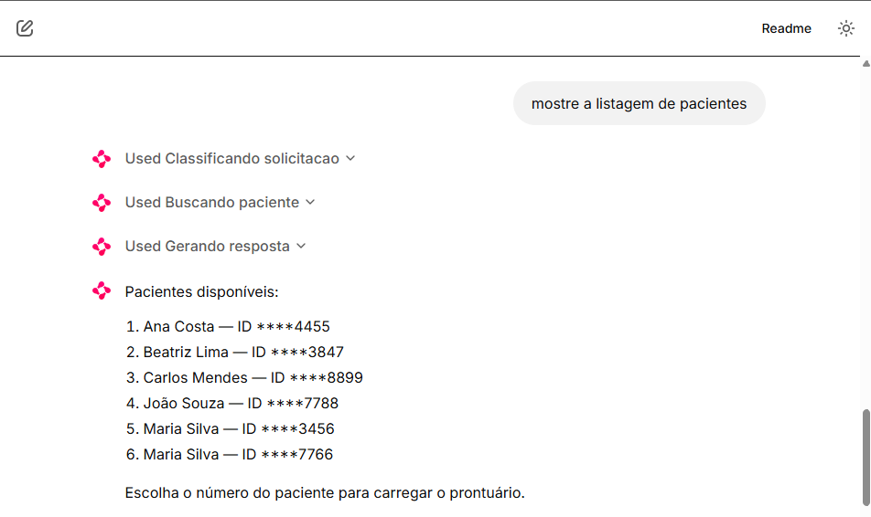
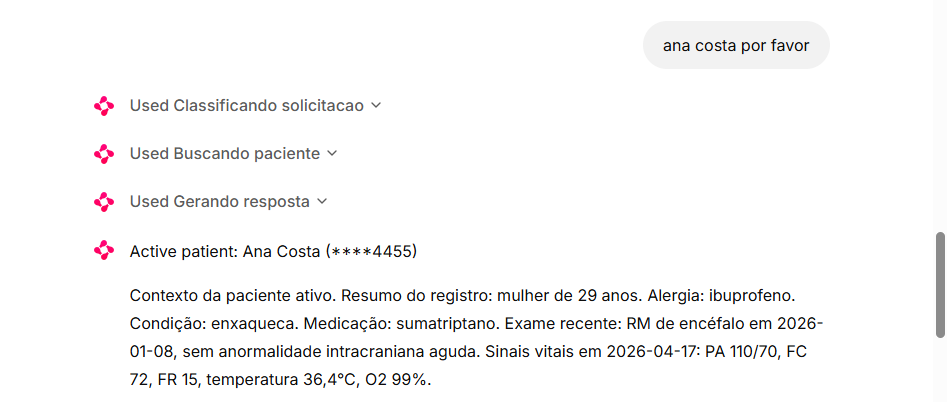
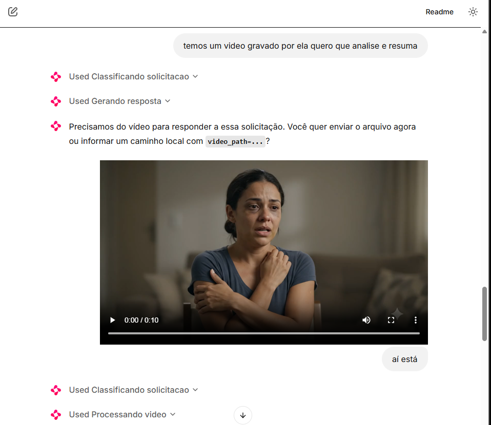
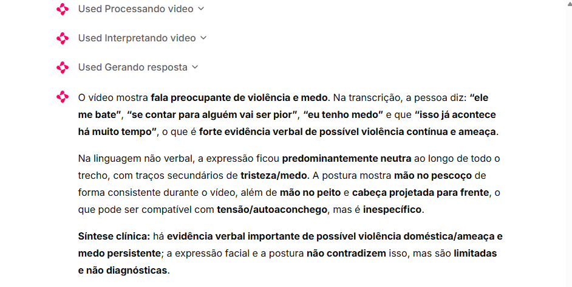
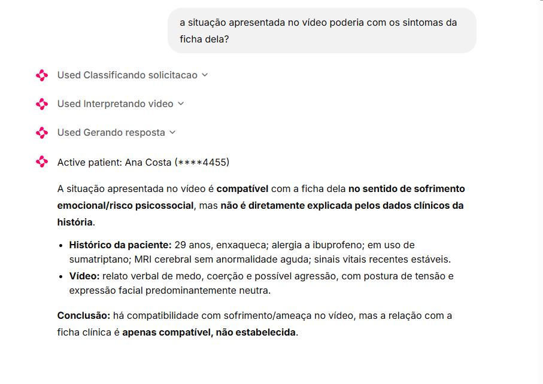
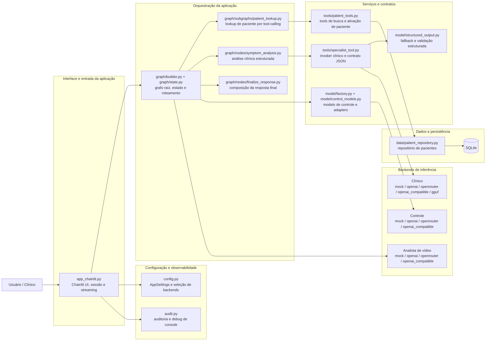
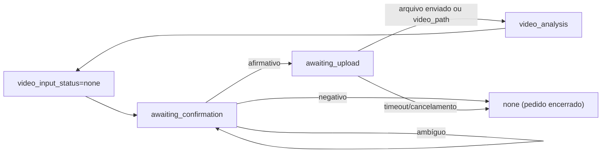

# Screening Robot

[](https://www.python.org/)
[](https://docs.langchain.com/oss/python/langgraph/overview)
[](https://docs.chainlit.io/)
[](https://unsloth.ai/docs)
[](https://huggingface.co/luizaaca)

🇺🇸 [Read in English](README.md)

Assistente multimodal de triagem clínica que combina **modelos especialistas Qwen fine-tuned**, um **runtime determinístico com LangGraph**, uma **interface conversacional em Chainlit** e **recuperação de contexto de pacientes em SQLite** em um fluxo ponta a ponta.

Na prática, o agente consegue listar/selecionar pacientes sintéticos, executar análise estruturada de sintomas, processar vídeos enviados ou locais (expressão, postura e transcrição) e correlacionar evidências do vídeo com o prontuário ativo em turnos de follow-up. O repositório também cobre o ciclo completo: engenharia de dataset, fine-tuning com QLoRA, confiabilidade de saída estruturada, observabilidade/auditoria e inferência com backends flexíveis (mock, APIs hospedadas, OpenAI-compatible e GGUF no clínico local).


### Capturas de tela do fluxo do agente


*Etapa 1 — O usuário pede ao assistente para listar os pacientes disponíveis.*


*Etapa 2 — O usuário informa o nome de uma paciente, e o assistente ativa o contexto e mostra um resumo conciso da ficha.*


*Etapa 3 — O usuário solicita análise de vídeo; o assistente pede o envio e a captura mostra o player do vídeo no fluxo da conversa.*


*Etapa 4 — O assistente retorna a análise narrativa do vídeo enviado (sinais verbais, expressão facial e postura).* 


*Etapa 5 — O usuário pede uma análise de associação entre sintomas/histórico da ficha e os aspectos identificados no vídeo.*


## Sumário

- [Visão geral](#visão-geral)
- [Arquitetura e checklist de implementação](#arquitetura-e-checklist-de-implementação)
- [Arquitetura em alto nível](#arquitetura-em-alto-nível)
- [Pipeline de fine-tuning e evolução dos modelos](#pipeline-de-fine-tuning-e-evolução-dos-modelos)
- [Modelos publicados](#modelos-publicados)
- [Runtime do assistente com LangGraph](#runtime-do-assistente-com-langgraph)
- [Pipeline de análise de vídeo e notebooks exploratórios](#pipeline-de-análise-de-vídeo-e-notebooks-exploratórios)
- [Segurança, validação e explicabilidade](#segurança-validação-e-explicabilidade)
- [Estrutura do repositório](#estrutura-do-repositório)
- [Stack tecnológica](#stack-tecnológica)
- [Como executar](#como-executar)
- [Prompts de exemplo](#prompts-de-exemplo)
- [Notebooks, scripts e datasets](#notebooks-scripts-e-datasets)
- [Testes](#testes)
- [Referências oficiais](#referências-oficiais)
- [Limitações](#limitações)

## Visão geral

`Screening Robot` é um protótipo de assistente de triagem clínica construído sobre duas camadas complementares:

1. **Camada de controle** — roteia solicitações, coordena ferramentas, faz lookup de paciente e compõe a resposta final.
2. **Camada especialista clínica** — produz saída clínica estruturada, confiável para consumo pelo grafo.

O projeto evoluiu de experimentos em notebook para uma aplicação Python modular em `src/screening_agent/`, com:

- **LangGraph** para orquestração com estado, roteamento orientado a `Command`, nós e subgrafos;
- **LangChain** para abstrações de modelos, tools e mensagens;
- **Chainlit** para a interface web conversacional;
- **video_pipeline** para extrair expressão, postura e transcrição de vídeos enviados ou locais;
- **Pydantic** para schemas e validação de saída estruturada;
- **SQLite** para contexto de paciente com RAG estruturado;
- **Unsloth + QLoRA** para fine-tuning eficiente dos modelos Qwen;
- **compatibilidade com GGUF** para inferência local.

O projeto utiliza datasets públicos de sintomas/doenças, enriquecimento sintético curado e registros sintéticos de pacientes em SQLite, possibilitando demonstrações reproduzíveis sem expor informações sensíveis.

## Arquitetura e checklist de implementação

| Técnica | Aplicação | Arquivos |
| --- | --- | --- |
| Fine-tuning de LLM com dados clínicos | Notebooks de treino + pipeline de dataset customizado | `screening_robot.ipynb`, `screening_robot_qwen3_1_7b_json.ipynb`, `process_clinical_batches.py` |
| Preprocessing e curadoria de dados | Normalização + estratégia com dados sintéticos | `process_clinical_batches.py`, `dataset_augmentation.ipynb`, `seed_demo_data.py`, base SQLite sintética |
| Assistente com LangChain | Abstrações de modelo/tool e fluxo por prompts | `src/screening_agent/model/`, `src/screening_agent/tools/`, `src/screening_agent/prompts/` |
| Orquestração com LangGraph | Grafo com estado, subgrafos e roteamento orientado a comandos | `src/screening_agent/graph/` |
| Acesso a base estruturada | Recuperação SQLite e ativação de contexto de paciente | `src/screening_agent/data/patient_repository.py`, `src/screening_agent/tools/patient_tools.py` |
| Análise de vídeo | Upload/path de vídeo, execução do pipeline, interpretação narrativa e extração clínica lazy | `app_chainlit.py`, `src/video_pipeline/`, `src/screening_agent/graph/nodes/video.py` |
| Segurança e validação | Fail-closed, disclaimers, retries, validação por schema | `src/screening_agent/model/structured_output.py`, `src/screening_agent/graph/nodes/finalize_response.py` |
| Observabilidade e auditoria | Eventos de log + modos de debug | `src/screening_agent/audit.py`, `.env.example` |
| Explainability e rastreabilidade | Racional do router, saída estruturada, contexto do paciente | `src/screening_agent/graph/state.py`, `specialist_tool.py`, `finalize_response.py` |

## Arquitetura em alto nível

O projeto é uma composição de **seis blocos funcionais**: interface, configuração/observabilidade, orquestração, serviços e contratos, dados/persistência e backends de inferência. Esta visão mostra como os módulos do repositório se encaixam.



### Blocos principais

**Interface e entrada da aplicação**
- `app_chainlit.py` é a porta de entrada da interface em Chainlit.
- A UI cria ou reutiliza um `thread_id` por sessão, carrega `AppSettings`, compila o grafo com `build_default_graph(...)` e transmite apenas os tokens gerados pelo nó `final_answer`.
- A interface não contém regras clínicas nem regras de lookup; ela apenas entrega cada turno ao runtime orquestrado.

**Configuração e observabilidade**
- `config.py` centraliza a configuração por ambiente: banco SQLite, backend do modelo de controle, backend clínico, modo de checkpoint e nível de debug.
- `audit.py` concentra auditoria e emissão de eventos de console ao longo do fluxo.
- Esses módulos são transversais: participam da aplicação inteira, mas não implementam a lógica de negócio em si.

**Orquestração da aplicação**
- `src/screening_agent/graph/` implementa o runtime principal em LangGraph.
- `src/screening_agent/prompts/` concentra os prompts de sistema usados pelos nós e subfluxos.
- O grafo raiz coordena roteamento, instruções de uso, lookup de paciente, análise de sintomas, limpeza de contexto, tratamento de erro e composição da resposta final.
- A análise de vídeo é feita por nós do grafo que chamam `src/video_pipeline`, salvam JSON compacto e resumo textual no estado, enviam interpretação narrativa para um backend de analista de vídeo dedicado e fazem extração clínica estruturada apenas nos fluxos de sintomas.
- O lookup de paciente e a análise clínica são encapsulados como subfluxos especializados, mas continuam subordinados ao mesmo estado de sessão.

**Serviços e contratos**
- O **modelo de controle** não serve apenas para classificar intenção: ele também dirige tool-calling, nós de suporte e a composição textual da resposta final.
- O **invoker clínico** em `tools/specialist_tool.py` encapsula o contrato estruturado `ClinicalScreeningOutput` e abstrai o backend clínico configurado.
- `tools/patient_tools.py` implementa as operações de busca por identificador, busca por nome e ativação de paciente no estado.
- `model/structured_output.py` adiciona fallback e reparo JSON para backends remotos; já os caminhos `mock` e `gguf` validam a saída por mecanismos próprios.

**Backends de Inferência**
- O backend de **controle** suporta `mock`, `openai`, `openrouter` e `openai_compatible`.
- O backend **clínico** suporta `mock`, `openai`, `openrouter`, `openai_compatible` e `gguf`.
- O backend de **analista de vídeo** suporta `mock`, `openai`, `openrouter` e `openai_compatible`.
- Os modelos Qwen fine-tuned pertencem ao caminho clínico; eles não são usados na camada de controle.

**Dados e persistência**
- `data/patient_repository.py` oferece acesso estruturado ao SQLite com busca por número identificador, busca por nome e recuperação do contexto clínico.
- O repositório opera sobre dados sintéticos e alimenta o contexto ativo usado na etapa de análise clínica.
- Trata-se de recuperação estruturada sobre SQLite, não de um índice vetorial.

### Relações arquiteturais importantes

- O Chainlit é a camada de apresentação; a lógica principal vive no grafo e nos serviços.
- O LangGraph é o runtime de aplicação e coordenação de estado; ele não substitui a camada de dados nem a camada de integração com modelos.
- O lookup de paciente e a análise clínica usam tool-calling, mas representam responsabilidades de negócio distintas.
- A composição da resposta final é uma etapa separada, responsável por transformar artefatos internos em texto exibido ao usuário.

Para detalhes do roteamento e fluxo de nós no LangGraph, consulte a seção **Runtime do assistente com LangGraph** abaixo.

### Estado do assistente

O runtime estende o `MessagesState` do LangGraph com campos específicos do assistente, como:

- `active_patient`
- `patient_lookup_status`
- `patient_lookup_candidates`
- `router_intent`
- `router_rationale`
- `specialist_output_json`
- `pending_video_request`
- `video_input_status`
- `incoming_video_path`
- `video_input_event`
- `video_path`
- `video_artifact_path`
- `video_artifact_dir`
- `video_analysis_summary`
- `video_analysis_json`
- `video_analysis_status`
- `video_analysis_error`
- `video_interpretation`
- `video_clinical_context_json`
- `video_clinical_context_fingerprint`
- `turn_outcome`
- `last_response`

Esse desenho de estado permite preservar contexto de curto prazo entre turnos sem acoplar regras de negócio à camada de UI.


## Pipeline de fine-tuning e evolução dos modelos

O projeto contém **duas gerações de fine-tuning**, e a diferença entre elas é central para entender a solução final.

### Versão 1 — `screening_robot.ipynb`

O primeiro notebook faz fine-tuning do **Qwen3-0.6B** com QLoRA em uma formulação sintoma → doença na qual o modelo produz uma resposta final com um disclaimer clínico fixo.

Características principais:

- modelo base leve para experimentação rápida;
- prompting misto com estilos `/think` e `/no_think`;
- avaliação com **accuracy**, **macro-F1**, **Cohen's Kappa**, **matriz de confusão** e **BERTScore**;
- exportação em LoRA + GGUF.

Por que ele não foi o modelo escolhido para o agente final:

- o comportamento de reasoning não foi incorporado com a força necessária para a orquestração posterior;
- o formato de resposta focado em disclaimer não se encaixou bem em uma tool especialista dentro do LangGraph;
- respostas livres eram mais difíceis de validar e integrar com confiabilidade em um agente tool-calling.

### Versão 2 — `screening_robot_qwen3_1_7b_json.ipynb`

O segundo notebook faz fine-tuning do **Qwen3-1.7B-Base** com **Unsloth + QLoRA** para um objetivo muito mais focado: emitir um payload JSON validável, desenhado especificamente para a tool especialista usada no runtime.

Schema alvo:

```json
{
  "support_status": "supported | inconclusive",
  "candidate_diseases": ["..."],
  "recommended_exams_tests": ["..."]
}
```

Por que essa versão virou a preferida do assistente:

- **maior alinhamento com o desenho agentic**;
- **saída estruturada é mais fácil de validar, repetir e auditar**;
- **1.7B parâmetros entregou um trade-off melhor** entre capacidade e eficiência local;
- integração natural com a tool `run_symptom_specialist` e com o passo de composição em `final_answer`.

### Engenharia e curadoria do dataset

Os dados de treino não vieram de um CSV único “cru”. O pipeline combinou datasets públicos com passos de enriquecimento customizados:

1. Combinação de fontes sintoma/doença em `combined_diseases_symptoms_2.csv`.
2. Execução de `process_clinical_batches.py` com scraping no site da [nhs.uk](https://www.nhs.uk/search) para gerar:
   - `support_status`
   - `candidate_diseases`
   - `recommended_exams_tests`
   - `reasoning`
3. Persistência em `combined_diseases_symptoms_2_enriched_with_exams_v2.csv`.
4. Publicação no Kaggle: [`luizaaca/symptoms-to-diseases-with-reasoning`](https://www.kaggle.com/datasets/luizaaca/symptoms-to-diseases-with-reasoning).

Esse pipeline inclui:

- normalização de sintomas;
- scoring heurístico de suporte;
- pesos estilo TF-IDF para sintomas;
- coleta assistida por web para exames sugeridos;
- ordenação estável de doenças candidatas;
- curadoria para treino estruturado downstream.

Na camada da aplicação, os dados de paciente são propositalmente **sintéticos** e armazenados em SQLite. Os registros demo usam identificadores fictícios e contexto clínico narrativo para que o repositório possa ser publicado sem expor dados reais.

### Configuração de treino usada no experimento JSON 1.7B

| Parâmetro | Valor |
| --- | --- |
| Modelo base | `Qwen/Qwen3-1.7B-Base` |
| Método de fine-tuning | QLoRA com Unsloth |
| Quantização | 4-bit |
| LoRA rank | 16 |
| LoRA alpha | 32 |
| Comprimento máximo de sequência | 1024 |
| Batch size | 2 |
| Gradient accumulation | 4 |
| Warmup steps | 20 |
| Max steps | 400 |
| Learning rate | `2e-4` |
| Weight decay | `0.01` |
| Máscara de loss | supervisão apenas na resposta |

### Metodologia de avaliação

Os notebooks avaliam tanto qualidade preditiva quanto confiabilidade operacional.

**Métricas clínicas**

- Accuracy
- F1-macro
- Cohen's Kappa
- Análise por matriz de confusão
- BERTScore

**Métricas de confiabilidade da saída estruturada**

- taxa de parse de JSON
- taxa de validação por schema
- validade de `support_status`
- presença da doença-alvo em `candidate_diseases`
- taxa de lista não vazia de exames recomendados

A escolha final do modelo considerou não só o comportamento bruto de classificação, mas também **aderência ao schema e compatibilidade downstream com o agente em LangGraph**.

## Modelos publicados

Os modelos treinados foram publicados no Hugging Face e podem ser referenciados diretamente a partir deste repositório.

| Modelo | Link | Finalidade | Estilo de saída |
| --- | --- | --- | --- |
| Qwen3-0.6B Clinical Screening | [`luizaaca/qwen3-0.6b-clinical-screening`](https://huggingface.co/luizaaca/qwen3-0.6b-clinical-screening) | Primeira iteração de fine-tuning para validar o enquadramento do problema | Resposta clínica em texto livre com disclaimer fixo |
| Qwen3-1.7B Clinical Screening | [`luizaaca/qwen3-1.7b-clinical-screening`](https://huggingface.co/luizaaca/qwen3-1.7b-clinical-screening) | Modelo final orientado à tool especialista e à integração com o agente | JSON clínico estruturado, alinhado a tool calling |

Observações:

- as duas páginas de modelo no Hugging Face expõem os artefatos com **CC-BY-4.0** nas respectivas páginas;
- a inferência local na aplicação pode usar uma rota **GGUF** configurada por `SCREENING_AGENT_GGUF_MODEL_PATH`;
- a arquitetura permite manter **modelo de controle** e **modelo clínico especialista** independentes.

## Runtime do assistente com LangGraph

O grafo principal está em `src/screening_agent/graph/` e é compilado por `build_default_graph(...)`.

O grafo raiz combina arestas explícitas de `StateGraph` com decisões `Command(..., goto=...)`. Na prática, o roteamento ocorre em três estágios:

1. tratamento determinístico de pendências de vídeo (`_route_pending_video_request`);
2. tratamento determinístico de follow-ups curtos contextuais (`_route_contextual_followup`);
3. classificação estruturada de intenção (`RouteDecision`) com fallback seguro para `final_answer` quando o structured output falha repetidamente.

```mermaid
flowchart LR
    START --> router
    router -->|usage_instructions| usage_instructions
    router -->|patient_lookup / patient_lookup_then_analysis| patient_lookup
    router -->|symptom_analysis| symptom_analysis
    router -->|video_analysis| video_analysis
    router -->|video_interpretation| video_interpretation
    router -->|video_qa (mapeado)| video_interpretation
    router -->|video_symptom_analysis| video_clinical_extraction
    router -->|video_upload_confirmation (mapeado)| invalid_request
    router -->|ramo de estado de video pendente| final_answer
    router -->|follow-up contextual curto| final_answer
    router -->|fallback de structured output| final_answer
    router -->|clear_active_patient| clear_active_patient
    router -->|invalid_request| invalid_request

    patient_lookup --> route_after_lookup
    route_after_lookup -->|lookup concluído para intent combinada| symptom_analysis
    route_after_lookup -->|lookup-only / seleção necessária / não encontrado| final_answer

    video_analysis --> route_after_video_analysis
    route_after_video_analysis -->|concluído + intent de vídeo geral| video_interpretation
    route_after_video_analysis -->|concluído + intent clínico com vídeo| video_clinical_extraction
    route_after_video_analysis -->|pipeline ausente/falhou| final_answer
    video_interpretation --> final_answer
    video_clinical_extraction --> route_after_video_clinical_extraction
    route_after_video_clinical_extraction -->|contexto extraido| symptom_analysis
    route_after_video_clinical_extraction -->|contexto indisponível| final_answer

    usage_instructions --> final_answer
    symptom_analysis --> final_answer
    clear_active_patient --> final_answer
    invalid_request --> final_answer
    final_answer --> END
```

### Nós principais e subgrafos

| Componente | Responsabilidade |
| --- | --- |
| `router` | Aplica guardas determinísticas de pré-roteamento e depois classifica a intenção com saída estruturada (`RouteDecision`) |
| `usage_instructions` | Explica como o assistente deve ser usado |
| `patient_lookup` | Executa o fluxo de recuperação de paciente |
| `route_after_lookup` | Decide se segue para análise ou responde imediatamente |
| `symptom_analysis` | Chama a tool especialista e captura a saída clínica estruturada |
| `video_analysis` | Executa `src/video_pipeline.process_video(...)`, salva JSON/resumo e escreve artefatos |
| `route_after_video_analysis` | Decide se o vídeo processado segue para interpretação narrativa ou extração clínica |
| `video_interpretation` | Produz interpretação narrativa do vídeo, com paciente ativo como contexto opcional |
| `video_clinical_extraction` | Extrai contexto clínico compacto do vídeo apenas em fluxos de sintomas |
| `route_after_video_clinical_extraction` | Continua para sintomas somente quando o contexto estruturado do vídeo existe |
| `clear_active_patient` | Limpa o contexto de paciente com segurança |
| `invalid_request` | Trata pedidos fora de escopo e respostas mapeadas de `video_upload_confirmation` |
| `final_answer` | Compõe a resposta final exibida ao clínico |

Nota: na implementação atual, falhas de structured output no `router` fazem fallback para `final_answer`.

### Guardas de pré-roteamento e máquina de estados de confirmação de vídeo

Antes da classificação estruturada de intenção, o router executa guardas determinísticas:

- `_route_pending_video_request(...)` controla os estados de confirmação/upload;
- `_route_contextual_followup(...)` roteia follow-ups curtos como `sim`, `yes`, `ok`, `continue` para `final_answer` quando já existe contexto anterior.




### Contextualização com recuperação de dados do paciente

O fluxo de patient lookup funciona como uma camada de RAG estruturado sobre SQLite.

- `find_by_security_number(...)` recupera um paciente por ID fictício;
- `search_by_name(...)` ranqueia resultados por match exato, prefixo e substring;
- `activate_patient_selection(...)` resolve ambiguidade de nomes entre turnos;
- o `clinical_context` recuperado é injetado no fluxo de análise de sintomas.

A base demo possui **seis pacientes sintéticos** e pode ser inicializada com `python seed_demo_data.py`.

### Tool especialista e backends

A tool especialista está em `src/screening_agent/tools/specialist_tool.py` e suporta três estratégias de execução:

1. **mock** — comportamento determinístico e offline para desenvolvimento e testes;
2. **modelo remoto estruturado** — OpenAI / OpenRouter / OpenAI-compatible;
3. **runtime GGUF local** — para inferência local a partir de um artefato implantado.

Matriz de suporte por camada:

| Camada | Backends suportados |
| --- | --- |
| Modelo de controle | `mock`, `openai`, `openrouter`, `openai_compatible` |
| Modelo clínico | `mock`, `openai`, `openrouter`, `openai_compatible`, `gguf` |
| Modelo analista de vídeo | `mock`, `openai`, `openrouter`, `openai_compatible` |

### Fluxo de vídeo

A aplicação Chainlit aceita vídeos de duas formas:

- upload de um arquivo de vídeo na UI;
- caminho local na mensagem, por exemplo `video_path=concepts_video/sample.mp4` ou `path: C:/videos/sample.mp4`.

Caminhos relativos de vídeo são resolvidos a partir da raiz do repositório (`PROJECT_ROOT`) por `video_pipeline.paths.resolve_project_path(...)`. Caminhos absolutos e expansão de `~` são suportados. As extensões aceitas por padrão no Chainlit são `.mp4`, `.mov`, `.avi`, `.mkv`, `.webm` e `.m4v`.

O Chainlit cuida apenas de I/O: mensagem, upload, timeout/cancelamento, streaming e progresso visual. O grafo decide se precisa de vídeo. Se uma solicitação precisa de vídeo e não há vídeo ativo, upload ou path disponível, o `final_answer` pede confirmação primeiro; só a confirmação positiva ativa `AskFileMessage`. O arquivo enviado reinvoca o grafo com o pedido pendente.

Antes da classificação de intenção por LLM, o router executa guardas determinísticas para pendências de confirmação/upload de vídeo e para follow-ups curtos contextuais. Por isso, turnos como `sim`, `yes` ou `continue` podem ir direto para `final_answer` quando já existe contexto suficiente da resposta anterior.

Upload direto ou path local válido pula a confirmação e executa o caminho real de `process_video(...)`. Uploads gerais seguem `video_analysis -> video_interpretation -> final_answer`. Solicitações de sintomas baseadas em vídeo seguem `video_analysis -> video_clinical_extraction -> symptom_analysis -> final_answer`; `video_clinical_context_json` só é criado nesse fluxo.

As regras de reuso e lazy processing são explícitas:

- `video_analysis` reaproveita artefatos quando o mesmo caminho normalizado já foi concluído no thread atual.
- `video_interpretation` e `video_clinical_extraction` podem acionar `video_analysis` de forma lazy quando o payload ainda não existe ou pertence a outro vídeo.
- `video_clinical_extraction` reaproveita o contexto clínico quando o fingerprint `sha256(source_path + normalized_latest_user_message)` coincide com o fingerprint armazenado.

Fluxos atuais de vídeo no agente:

| Fluxo do usuário | Caminho no runtime | Resultado |
| --- | --- | --- |
| Upload ou path explícito para análise geral de vídeo | `video_analysis -> video_interpretation -> final_answer` | Executa o pipeline completo, salva artefatos compactos e retorna interpretação narrativa |
| Pergunta posterior sobre o vídeo ativo | `video_interpretation -> final_answer` | Reutiliza o JSON e o resumo de vídeo já armazenados, sem reprocessar o mesmo arquivo |
| Pedido clínico/de sintomas com evidência em vídeo | `video_analysis -> video_clinical_extraction -> symptom_analysis -> final_answer` | Extrai contexto clínico compacto do vídeo e encaminha para a tool especialista clínica |
| Pedido de vídeo sem upload, vídeo ativo ou path explícito | `final_answer`, depois `AskFileMessage` opcional após confirmação | Evita abrir upload apenas porque o usuário mencionou vídeo |

As saídas processadas são gravadas em `SCREENING_AGENT_VIDEO_PIPELINE_OUTPUT_DIR/{thread_id}`. O estado padrão mantém resumo compacto e JSON serializado; sidecars de debug ficam no diretório de artefatos do pipeline. O progresso visual do Chainlit usa `cl.Step` sanitizado apenas para nodes principais; prompts, payloads clínicos brutos e JSON completo de vídeo não aparecem nos steps padrão.

## Pipeline de análise de vídeo e notebooks exploratórios

A funcionalidade de vídeo é dividida em duas camadas:

1. `src/video_pipeline/` é o pacote de processamento de mídia. Ele extrai metadados, lê frames, extrai áudio, executa processadores por modalidade, grava artefatos JSON e retorna um `VideoAnalysisResult` em memória.
2. `src/screening_agent/` consome esse resultado dentro do LangGraph. O agente mantém JSON compacto e resumo no estado, usa um backend dedicado de analista de vídeo para interpretação narrativa e só deriva contexto clínico do vídeo quando um fluxo de análise de sintomas precisa dele.

### Contrato de `src/video_pipeline`

O ponto de entrada público é `process_video(video_path, config=...)`. O orquestrador resolve o caminho do vídeo, monta metadados com OpenCV/MoviePy, entrega frames sequenciais aos processadores visuais, processa áudio quando disponível, agrega janelas e grava artefatos opcionais.

| Módulo | Processador | Saída |
| --- | --- | --- |
| Expressão facial | `ExpressionDeepFaceProcessor` com análise de emoção do DeepFace | Detecções por janela usando labels normalizados: `anger_expression`, `disgust_expression`, `fear_expression`, `joy_expression`, `neutral_expression`, `sad_expression`, `surprise_expression` |
| Postura | `PoseMediaPipeProcessor` com MediaPipe Tasks Holistic | Regras posturais por janela seguindo `rule_order`: `hand_on_head`, `hand_on_neck`, `hand_on_chest`, `head_down`, `forward_head`, `rounded_shoulders_or_asymmetry` |
| Transcrição | `TranscriptionWhisperProcessor` após extração de áudio com MoviePy | `text` no estilo Whisper e `segments` com timestamps; quando não há áudio, `has_audio=false` com texto/segmentos vazios |

Quando `output_dir` está configurado, o pipeline grava arquivos compactos por módulo:

- `{video_id}.expression.json`
- `{video_id}.pose.json`
- `{video_id}.transcription.json`

Quando `debug=true`, ele também grava sidecars como `{video_id}.pose.debug.json` com metadados, configuração, evidências por frame, payloads dos processadores e diagnósticos. O processador de transcrição também pode gravar artefatos de debug como `{video_id}.transcription.segments.csv` e `{video_id}.transcription.srt` quando habilitados na configuração. Os JSONs padrão continuam enxutos para que o agente possa passá-los aos prompts sem carregar payloads completos de debug.

### Schema de detecção usado em expressão e postura

Os dois módulos visuais convergem para o mesmo contrato compacto por janela:

- `DetectionWindow.start_s`, `DetectionWindow.end_s`
- `DetectionWindow.detections[]`
    - `label`
    - `score` (score agregado do label dentro da janela)
    - `support` (proporção de frames válidos/scorable que sustentam o label)
- `DetectionWindow.dominant`
    - `label`
    - `score`

Esse schema compartilhado permite que os nós de interpretação de vídeo e resposta final raciocinem sobre expressão e postura com uma interface única.

### Trilha exploratória em `concepts_video/`

O pipeline de produção nasceu de uma investigação incremental em notebooks, não de uma única implementação direta.

| Ordem | Artefato exploratório | O que foi investigado | Resultado |
| --- | --- | --- | --- |
| 1 | `concepts_video/opencv_mobilenetv2_facial_expression.ipynb` e `concepts_video/opencv_mobilenetv2_video_emotion_timeline.ipynb` | Detecção de face/expressão com baseline OpenCV + MobileNetV2 | Útil como baseline inicial, mas menos adequado como motor final de expressão |
| 2 | `concepts_video/deepface_video_emotion_timeline.ipynb` e `concepts_video/deepface_video_emotion_timeline_v2.ipynb` | Emoções faciais com DeepFace, vídeos anotados, agregação temporal e JSON compacto | Virou referência para a branch de expressão e para o contrato de saída de vídeo em uma passada |
| 3 | `concepts_video/plan_NTU.md` e `concepts_video/ntu_model_training.ipynb` | Abordagem NTU RGB+D para reconhecimento de ações/postura em vídeo completo | Foi útil para modelagem de ações por classe (por exemplo toque em cabeça/pescoço e sinais de náusea), mas não foi adotada no runtime final por necessidade de evidência interpretável em nível de frame |
| 4 | `concepts_video/plan_mediapipe_posture.md`, `concepts_video/mediapipe_video_posture_timeline.ipynb`, `v2`, `v3` e os markdowns de análise | Sinais de postura e contato a partir de landmarks do MediaPipe com agregação por janelas | Virou a branch de postura de produção, com o v3 consolidando suavização EMA, scoring geométrico de regras e artefatos de timeline mais robustos |
| 5 | `concepts_video/whisper_moviepy_transcription.ipynb` | Extração local de áudio de vídeo com MoviePy e transcrição com Whisper | Virou a branch de transcrição: extração de áudio, texto ASR normalizado e segmentos com timestamps |

As decisões duráveis ficam em `concepts_video/plan_video_pipeline_expression_pose.md`; os planos de integração com o agente ficam em `concepts_video/plan_screening_agent_video_integration*.md`.

## Segurança, validação e explicabilidade

Sistemas voltados para saúde precisam ser chatos nos lugares certos.

### Limites de atuação

- o assistente é apresentado como **ferramenta de suporte à triagem clínica**, não como mecanismo de diagnóstico definitivo;
- as respostas finais incluem disclaimer explícito de que o sistema **não substitui julgamento profissional**;
- requisições inválidas ou fora de escopo são roteadas para respostas específicas de contenção.

### Output estruturado com fail-closed

`ResilientStructuredOutputInvoker`, em `src/screening_agent/model/structured_output.py`, usa uma estratégia de retry limitada:

1. tentativa nativa de structured output;
2. fallback com reparo JSON;
3. tentativa final de reparo JSON;
4. erro delimitado e desvio para caminho determinístico de falha.

Isso evita corrupção silenciosa quando o modelo sai do schema esperado.

### Auditoria e modos de debug

Eventos de auditoria são emitidos ao longo do fluxo com campos como:

- `timestamp_utc`
- `event_type`
- `status`
- `node_name`
- `detail`

O sistema de debug no terminal suporta:

- `SCREENING_AGENT_CONSOLE_DEBUG_MODE=none`
- `SCREENING_AGENT_CONSOLE_DEBUG_MODE=info`
- `SCREENING_AGENT_CONSOLE_DEBUG_MODE=debug`

Valores sensíveis, como números de segurança, são mascarados antes do print em console.

### Recursos de explicabilidade

O runtime preserva estruturas intermediárias interpretáveis:

- o racional do router fica no estado;
- a saída do especialista mantém `support_status`, `candidate_diseases` e `recommended_exams_tests` explícitos;
- o contexto de paciente vem de uma fonte conhecida no repositório;
- a resposta final é composta a partir de artefatos estruturados produzidos anteriormente.

## Estrutura do repositório

```text
.
├── app_chainlit.py
├── process_clinical_batches.py
├── screening_robot.ipynb
├── screening_robot_qwen3_1_7b_json.ipynb
├── langgraph_router_specialists_simple.ipynb
├── langgraph_router_specialists_simple_v2.ipynb
├── langgraph_router_specialists_simple_v3.ipynb
├── langgraph_router_specialists_video.ipynb
├── langgraph_router_specialists_video_v2.ipynb
├── concepts_video/
│   ├── opencv_mobilenetv2_video_emotion_timeline.ipynb
│   ├── deepface_video_emotion_timeline_v2.ipynb
│   ├── mediapipe_video_posture_timeline_v3.ipynb
│   ├── whisper_moviepy_transcription.ipynb
│   └── plan_video_pipeline_expression_pose.md
├── seed_demo_data.py
├── src/
│   ├── screening_agent/
│   │   ├── audit.py
│   │   ├── config.py
│   │   ├── data/
│   │   ├── graph/
│   │   ├── model/
│   │   ├── prompts/
│   │   └── tools/
│   └── video_pipeline/
│       ├── configs/
│       ├── processors/
│       ├── orchestrator.py
│       └── contracts.py
└── tests/
```

### Diretórios principais

- `src/screening_agent/data/` — schema SQLite, repositório e utilitários de seed
- `src/screening_agent/graph/` — schema de estado, builder do grafo, nós e subgrafos
- `src/screening_agent/model/` — adapters de modelo, runtime mock e fallback de structured output
- `src/screening_agent/prompts/` — prompts de sistema por responsabilidade
- `src/screening_agent/tools/` — tools de busca de paciente e tool clínica especialista
- `src/video_pipeline/` — metadados de vídeo, leitura de frames, expressão, postura, transcrição e writers JSON
- `concepts_video/` — notebooks exploratórios de análise de vídeo, planos, assets de modelo, entradas de amostra e saídas geradas
- `tests/` — cobertura automatizada determinística do runtime principal

## Stack tecnológica

### Dependências de runtime

- `chainlit>=2.11.1`
- `langchain>=1.2.15`
- `langgraph>=1.1.10`
- `langchain-openai>=1.2.1`
- `langchain-openrouter>=0.2.1`
- `openai>=2.32.0`
- `pydantic>=2.13.2`
- `python-dotenv>=1.2.2`

### Stack opcional de vídeo

Instalada com `pip install -e .[video]` ou `pip install -e .[dev,video]`:

- DeepFace e `tf-keras`
- MediaPipe
- OpenCV
- MoviePy
- OpenAI Whisper

### Stack de treino e avaliação

- Unsloth
- PyTorch
- TRL / SFTTrainer
- scikit-learn
- evaluate / BERTScore
- pandas / NumPy / seaborn / matplotlib
- llama-cpp-python (para experimentos com runtime GGUF)

## Como executar

### Pré-requisitos

- Python **3.13+**
- suporte a ambiente virtual
- Git
- endpoint de modelo ou artefato GGUF local, caso você queira inferência real em vez do modo mock

### Instalação

```bash
python -m venv .venv
source .venv/Scripts/activate
pip install -e .[dev]
```

Instale as dependências opcionais de vídeo quando quiser executar o pipeline real:

```bash
pip install -e .[dev,video]
```

### Configuração

Copie `.env.example` para `.env` e ajuste o setup de modelos conforme o backend desejado.

Variáveis importantes:

- `SCREENING_AGENT_CONTROL_BACKEND`
- `SCREENING_AGENT_CONTROL_MODEL`
- `SCREENING_AGENT_CLINICAL_BACKEND`
- `SCREENING_AGENT_CLINICAL_MODEL`
- `SCREENING_AGENT_VIDEO_ANALYST_BACKEND`
- `SCREENING_AGENT_VIDEO_ANALYST_MODEL`
- `SCREENING_AGENT_VIDEO_ANALYST_BASE_URL`
- `SCREENING_AGENT_VIDEO_ANALYST_API_KEY`
- `SCREENING_AGENT_VIDEO_ANALYST_TEMPERATURE`
- `SCREENING_AGENT_VIDEO_PIPELINE_OUTPUT_DIR`
- `SCREENING_AGENT_VIDEO_PIPELINE_DEBUG`
- `SCREENING_AGENT_VIDEO_PIPELINE_WINDOW_S`
- `SCREENING_AGENT_VIDEO_PIPELINE_STRIDE_S`
- `SCREENING_AGENT_VIDEO_UPLOAD_MAX_MB`
- `SCREENING_AGENT_GGUF_MODEL_PATH`
- `SCREENING_AGENT_USE_IN_MEMORY_CHECKPOINTER=true`
- `SCREENING_AGENT_CONSOLE_DEBUG_MODE`

A configuração padrão foi pensada para demos locais seguras:

```env
SCREENING_AGENT_CONTROL_BACKEND=mock
SCREENING_AGENT_CLINICAL_BACKEND=mock
SCREENING_AGENT_VIDEO_ANALYST_BACKEND=mock
SCREENING_AGENT_USE_IN_MEMORY_CHECKPOINTER=true
```

### Popular a base demo

```bash
python seed_demo_data.py
```

### Executar a aplicação

```bash
chainlit run app_chainlit.py
```

Abra a URL local exibida no terminal e inicie a conversa.

Comportamento de idioma: o Chainlit segue o idioma do navegador porque `[UI].language` fica intencionalmente indefinido em `.chainlit/config.toml`. O app inclui assets de UI em `pt-BR` e `en-US`; definir `language = "pt-BR"` força português para todos os usuários e desativa a troca baseada no navegador.

### Troca de provider

O repositório suporta múltiplas estratégias de inferência sem alterar o código Python:

- **Mock mode** — ideal para demos, testes e desenvolvimento offline
- **OpenAI** — inferência hospedada direta
- **OpenRouter** — inferência remota multi-provider
- **OpenAI-compatible** — endpoints locais ou self-hosted no estilo LM Studio
- **GGUF** — backend clínico local para a tool especialista
- **Analista de vídeo** usa `SCREENING_AGENT_VIDEO_ANALYST_*` e suporta `mock`, `openai`, `openrouter` e `openai_compatible`

Consulte `.env.example` para os nomes exatos das variáveis e exemplos.

## Prompts de exemplo

- `Find patient Maria Silva`
- `Lookup patient 12003456`
- `Patient 55667788 has fatigue and frequent urination`
- `Analyze this video with video_path=concepts_video/sample.mp4`
- `Quais padrões de postura ou expressão aparecem no vídeo enviado?`
- `Clear active patient`
- `How should I use this assistant?`

## Notebooks, scripts e datasets

| Artefato | Finalidade |
| --- | --- |
| `screening_robot.ipynb` | Primeiro experimento ponta a ponta com fine-tuning em Qwen3-0.6B |
| `screening_robot_qwen3_1_7b_json.ipynb` | Experimento final de fine-tuning estruturado com Qwen3-1.7B |
| `langgraph_router_specialists_simple.ipynb` | Conceito mínimo de roteamento com LangGraph |
| `langgraph_router_specialists_simple_v2.ipynb` | Notebook intermediário com contexto de paciente mais rico e flexibilidade de backend |
| `langgraph_router_specialists_simple_v3.ipynb` | Padrão orientado à produção para integração estruturada do especialista |
| `langgraph_router_specialists_video.ipynb` | Primeiro protótipo de roteamento com especialista de vídeo |
| `langgraph_router_specialists_video_v2.ipynb` | Notebook cumulativo de roteamento de vídeo usando o caminho real `src/video_pipeline.process_video(...)` |
| `concepts_video/opencv_mobilenetv2_video_emotion_timeline.ipynb` | Baseline inicial de expressão facial em vídeo com OpenCV e MobileNetV2 |
| `concepts_video/deepface_video_emotion_timeline_v2.ipynb` | Referência de análise de expressão com DeepFace, vídeo anotado e JSON compacto |
| `concepts_video/ntu_model_training.ipynb` | Exploração com NTU/action recognition que não foi escolhida para o fluxo final de postura |
| `concepts_video/mediapipe_video_posture_timeline_v3.ipynb` | Notebook atual de postura com MediaPipe, sinais por frame, agregação por janelas e vídeo anotado |
| `concepts_video/whisper_moviepy_transcription.ipynb` | Protótipo local MoviePy + Whisper para extração de áudio e transcrição |
| `concepts_video/plan_video_pipeline_expression_pose.md` | Artefato de planejamento que orientou o contrato multimodal de `src/video_pipeline` |
| `dataset_augmentation.ipynb` | Experimentos de validação e augmentação assistidos por LLM |
| `process_clinical_batches.py` | Pipeline batch para enriquecer suporte, candidatos, exames e reasoning |
| `combined_diseases_symptoms_2_enriched_with_exams_v2.csv` | Dataset customizado enriquecido para treino |
| `data/patients.sqlite3` | Base sintética de pacientes usada pela aplicação |

## Testes

Execute a suíte automatizada com:

```bash
python -m pytest tests/
```

A cobertura atual inclui:

- lookups e ranking do repositório de pacientes;
- roteamento do grafo e transições entre nós;
- conversas end-to-end em mock mode;
- parsing de path/upload de vídeo, configuração de vídeo, processamento no grafo, interpretação de vídeo e extração clínica lazy;
- lógica de fallback de structured output;
- seed dos dados demo;
- helpers de estado e comportamento de debug no terminal.

## Referências oficiais

- LangChain overview: <https://docs.langchain.com/oss/python/langchain/overview>
- LangGraph overview: <https://docs.langchain.com/oss/python/langgraph/overview>
- LangGraph graph API: <https://docs.langchain.com/oss/python/langgraph/graph-api>
- Chainlit overview: <https://docs.chainlit.io/>
- Chainlit installation: <https://docs.chainlit.io/get-started/installation>
- Unsloth docs: <https://unsloth.ai/docs>
- Pydantic docs: <https://pydantic.dev/docs/validation/latest/get-started/>
- Organização Qwen no Hugging Face: <https://huggingface.co/Qwen>
- Repositório do modelo — Qwen3-0.6B clinical screening: <https://huggingface.co/luizaaca/qwen3-0.6b-clinical-screening>
- Repositório do modelo — Qwen3-1.7B clinical screening: <https://huggingface.co/luizaaca/qwen3-1.7b-clinical-screening>
- Dataset no Kaggle — symptoms to diseases with reasoning: <https://www.kaggle.com/datasets/luizaaca/symptoms-to-diseases-with-reasoning>

## Limitações

- Este projeto **não** é um dispositivo médico e não deve ser usado como substituto de um profissional habilitado.
- Saídas de vídeo são artefatos de suporte à triagem; evidências de expressão, postura e transcrição não devem ser tratadas como diagnóstico definitivo.
- O processamento de vídeo é orientado a lote por arquivo enviado/caminho informado; não é um sistema de diagnóstico por streaming em tempo real.
- Interpretação e extração clínica de vídeo usam o backend configurado de analista de vídeo e não constituem um modelo médico de vídeo fine-tuned dedicado.
- O processamento real de vídeo requer dependências opcionais instaladas com `.[video]` e pode falhar fechado quando assets de modelo ou codecs de mídia não estiverem disponíveis.
- A confiabilidade de postura/contato depende de visibilidade, enquadramento e iluminação; oclusão severa ou baixa qualidade de imagem reduzem a qualidade dos landmarks.
- A qualidade da transcrição com Whisper depende das condições de áudio, idioma e clareza da gravação.
- O repositório público utiliza **pacientes sintéticos** e datasets públicos em vez de dados hospitalares reais.
- A camada de recuperação atual é **SQLite estruturado**, não uma base vetorial.
- Questões de produção, como autenticação, persistência de longo prazo e hardening de deploy, estão fora do escopo desta versão.

Para explorar o projeto, comece por `langgraph_router_specialists_simple_v3.ipynb` para entender como funciona o agente com langgraph, depois `screening_robot_qwen3_1_7b_json.ipynb` para entender o pipeline de treinamento do modelo final, e `app_chainlit.py` para a interface conversacional.
