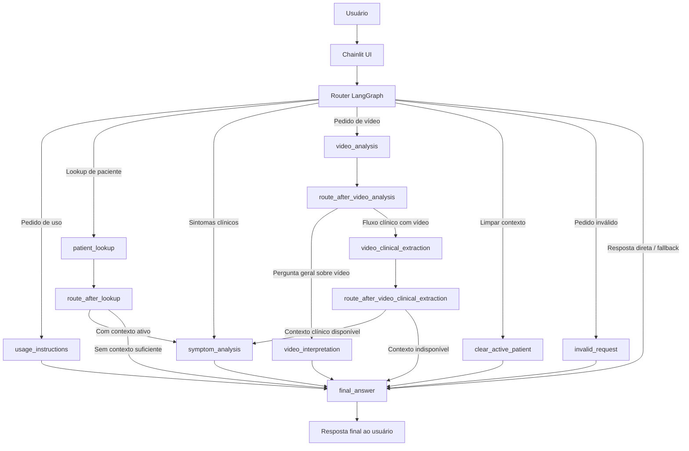
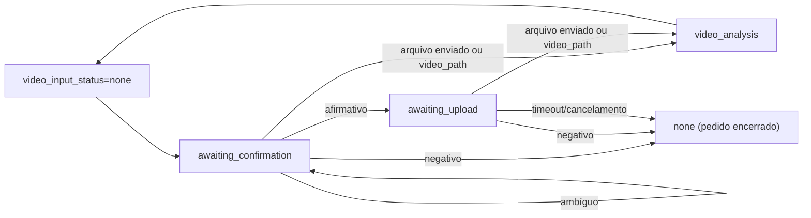
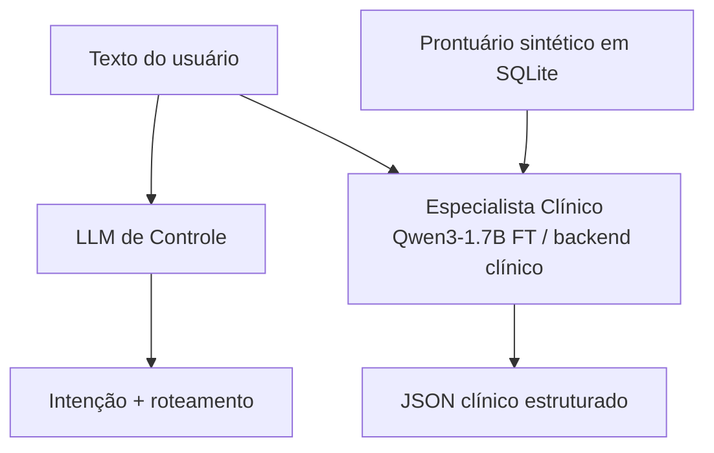
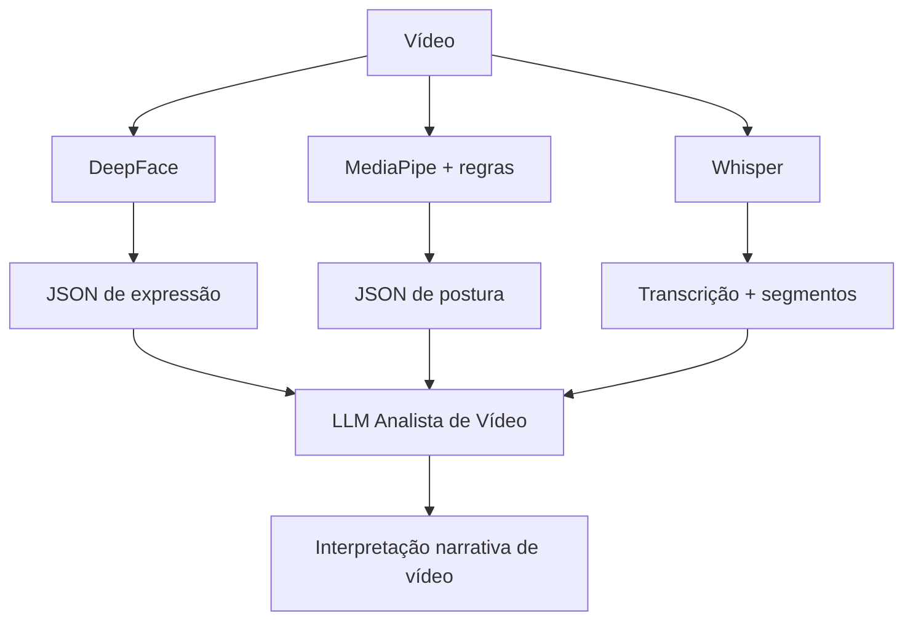
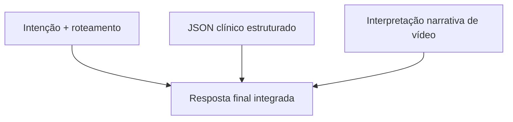
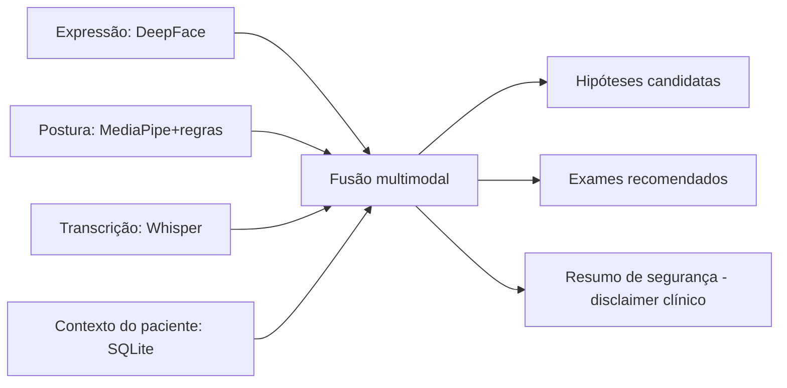

# Relatório Técnico Resumido — Screening Robot

Este documento resume a arquitetura e os resultados do projeto `Screening Robot` com foco em operação multimodal (texto clínico + vídeo), modelos por tipo de dado e exemplos de anomalias detectáveis no pipeline.

> Escopo: visão técnica condensada do `README.md` / `README_pt-br.md` para leitura rápida de arquitetura e capacidades.

## 1) Descrição do fluxo multimodal

O runtime combina **roteamento com LangGraph**, **contexto de paciente em SQLite**, **análise clínica estruturada** e **pipeline de vídeo** em um único fluxo de sessão.

### Fluxo ponta a ponta

### Comportamentos operacionais importantes

- **Pré-roteamento determinístico** para confirmação/upload de vídeo e follow-ups curtos contextuais.
- **Processamento lazy**: o vídeo só é processado quando necessário para o fluxo atual.
- **Reuso de artefatos**: evita reprocessar o mesmo arquivo em turnos subsequentes do mesmo thread.
- **Fail-closed em saída estruturada**: fallback para resposta segura quando parsing/validação falham.
- **Alias de intenção no runtime**: `video_qa` é roteado para o nó `video_interpretation`.

### Máquina de estados de confirmação/upload de vídeo

---

## 2) Modelos aplicados em cada tipo de dado

| Tipo de dado | Modelo / técnica principal | Camada | Saída principal |
| --- | --- | --- | --- |
| Intenção e controle conversacional | LLM de controle (backend configurável: `mock`, `openai`, `openrouter`, `openai_compatible`) | `screening_agent` (router/finalização) | Intenção estruturada e resposta final coerente com estado |
| Texto clínico (sintomas) | **Qwen3-1.7B fine-tuned com QLoRA** (ou backend clínico configurado) | Tool especialista clínica | JSON estruturado com `support_status`, `candidate_diseases`, `recommended_exams_tests` |
| Frames de vídeo (expressão facial) | **DeepFace** (emoções por janela temporal) | `video_pipeline` | Labels como `sad_expression`, `fear_expression`, `neutral_expression` etc. |
| Frames de vídeo (postura/gestos) | **MediaPipe Holistic + regras posturais** | `video_pipeline` | Labels como `head_down`, `hand_on_neck`, `forward_head` etc. |
| Áudio de vídeo (fala) | **Whisper** (ASR) via extração de áudio | `video_pipeline` | Transcrição textual + segmentos com timestamp |
| Interpretação multimodal de vídeo | LLM analista de vídeo (backend configurável: `mock`, `openai`, `openrouter`, `openai_compatible`) | Nó `video_interpretation` | Resumo narrativo multimodal para suporte à triagem |

### Mapa dados → modelos → artefatos

#### 2.1 Fluxo clínico textual

#### 2.2 Fluxo de vídeo por modalidade

#### 2.3 Composição final da resposta

---

## 3) Resultados obtidos (estado atual do projeto)

### Resultados de arquitetura e integração

1. **Fluxo multimodal unificado em produção local**: a aplicação conversa, ativa paciente, processa vídeo e correlaciona evidências em turnos de follow-up.
2. **Contrato clínico estruturado operacional**: a camada especialista retorna payload validável para consumo do grafo.
3. **Pipeline de vídeo modularizado**: expressão, postura e transcrição com artefatos compactos por modalidade.
4. **Interpretação multimodal contextual**: síntese textual do vídeo pode considerar contexto do paciente ativo.
5. **Confiabilidade de execução**: fallbacks de structured output e rotas seguras em casos de falha.

### Evidências práticas no repositório

- Fluxos e nós implementados em `src/screening_agent/graph/`.
- Processamento multimodal em `src/video_pipeline/`.
- Interface de execução e upload em `app_chainlit.py`.
- Cobertura de cenários-chave em `tests/` (roteamento, vídeo, fallback estruturado, contexto de paciente).

> Observação: este resumo prioriza resultados funcionais e de integração. Métricas quantitativas de treino/avaliação detalhadas permanecem nos notebooks de fine-tuning.

---

## 4) Exemplos de anomalias detectadas

As anomalias abaixo são **sinais de suporte à triagem** (não diagnóstico definitivo) e são detectadas por janelas temporais com score/suporte.

| Modalidade | Exemplo de anomalia/sinal | Como aparece tecnicamente | Utilidade na triagem |
| --- | --- | --- | --- |
| Postura | `head_down` sustentado | Predomínio de label em janelas consecutivas | Pode indicar desconforto, baixa energia ou retraimento comportamental |
| Postura | `hand_on_neck` recorrente | Regra geométrica acionada por landmarks | Pode sinalizar tensão/ansiedade situacional |
| Postura | `rounded_shoulders_or_asymmetry` | Assimetria de ombros e projeção de cabeça | Pode sugerir sobrecarga postural/fadiga |
| Expressão facial | `sad_expression` / `fear_expression` com suporte alto | Emoção dominante por janela no DeepFace | Indício afetivo que complementa relato verbal |
| Transcrição | Relato verbal de sintomas persistentes | Termos-chave no ASR com timestamps | Melhora rastreabilidade temporal do discurso |
| Multimodal (fusão) | Coincidência entre postura + expressão + fala | Correlação entre artefatos na mesma faixa temporal | Aumenta confiança para encaminhar hipótese e exames sugeridos |

### Visão de correlação de anomalias

---

## 5) Artefatos gerados no fluxo multimodal

- `video_artifact_path` e `video_artifact_dir` por thread de conversa.
- JSONs compactos por módulo de vídeo (`expression`, `pose`, `transcription`).
- `video_analysis_summary` e `video_analysis_json` no estado do grafo.
- `specialist_output_json` com saída clínica estruturada para composição da resposta final.

---

## 6) Conclusão técnica

O `Screening Robot` já opera como um assistente multimodal de triagem com:

- orquestração robusta via LangGraph,
- especialização clínica estruturada,
- processamento de vídeo em três modalidades,
- e composição final orientada por segurança e explicabilidade.

A evolução natural do projeto segue em três frentes: calibração quantitativa das detecções multimodais, expansão dos testes com datasets de vídeo mais variados e hardening de deploy para cenários reais de operação.