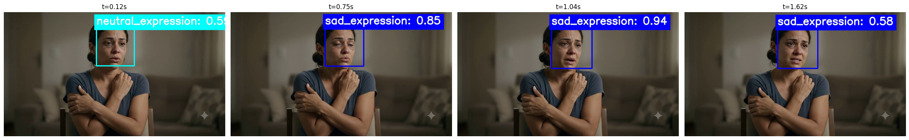
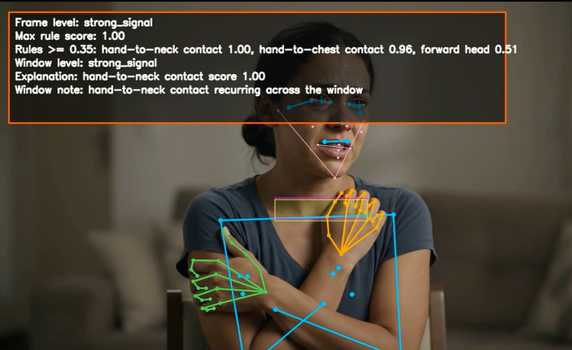
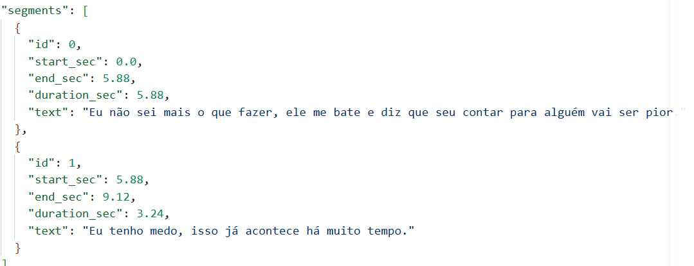

# Tech Challenge - Fase 4 - Pos Tech (FIAP)
## Projeto: Screening Robot

Abaixo apresento os dados para a entrega do Tech Challenge da Fase 4. O projeto consiste no **Screening Robot**, um assistente multimodal de triagem clínica de ponta a ponta projetado para monitorar pacientes, analisar dados multimodais e apoiar a decisão clínica.

### Links Principais
* **Repositório GitHub (Código-fonte completo):** https://github.com/luizaaca/screening_robot
* **Vídeo de Demonstração (YouTube):** https://youtu.be/M0Anro-xxSw

---

### Resumo do Projeto e Arquitetura Multimodal
O **Screening Robot** integra múltiplos modelos especialistas e fluxos determinísticos para realizar o monitoramento e triagem de pacientes em um fluxo conversacional rico:

1. **Análise de Vídeo e Postura (Multimodal):**
   * **Expressão Facial:** Uso do **DeepFace** para identificar emoções faciais que possam indicar dor, desconforto ou apatia.
   
   * **Análise Postural:** Uso do **MediaPipe Holistic** para extrair landmarks e mapear desvios e contatos anômalos em tempo real (como mãos na cabeça, pescoço ou peito, indicando desconforto).
   

2. **Análise de Áudio e Voz:**
   * Extração de áudio de consultas/vídeos via **MoviePy** e transcrição/processamento local das falas através do **OpenAI Whisper**.
   

3. **Orquestração e Estado:**
   * Desenvolvimento do fluxo do agente em **LangGraph**, garantindo transições de estados seguras, roteamento estruturado, tratamento de exceções e controle da máquina de estados do vídeo.
   * Interface conversacional moderna e interativa desenvolvida com **Chainlit**.

4. **Persistência e Consulta (RAG Estruturado):**
   * Integração de prontuários fictícios em base **SQLite** para lookup e ativação do contexto clínico de pacientes em tempo real.

O projeto foi projetado com alta segurança de dados (sem expor registros reais), suporte a variados backends (Mock, OpenAI/Azure, OpenRouter e GGUF local) e completa cobertura de testes automatizados. 

Toda a documentação técnica detalhada, checklist de entrega e instruções de execução local estão presentes no [README_pt-br.md](https://github.com/luizaaca/screening_robot/blob/main/README_pt-br.md).
Em [relatorio_tecnico_resumido.md](https://github.com/luizaaca/screening_robot/blob/main/docs/relatorio_tecnico_resumido.md) há o resumo das alterações em relação à versão anterior sem pipeline de vídeo.
